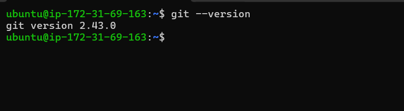
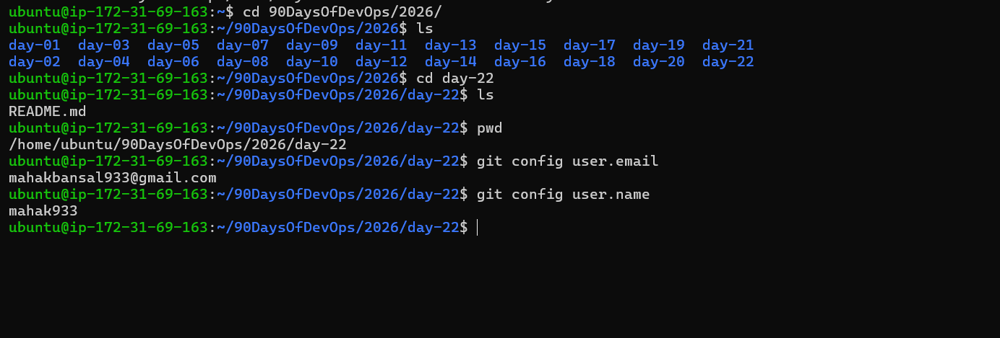
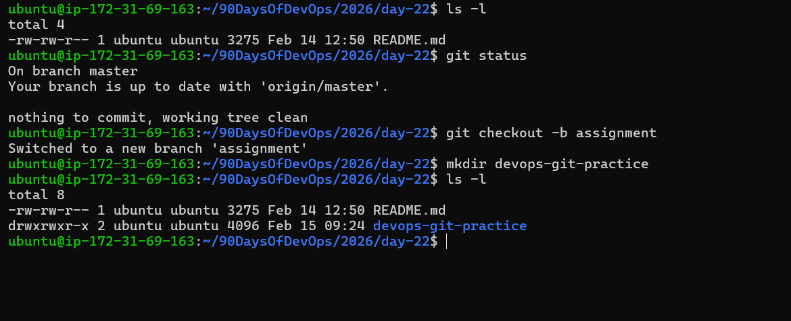
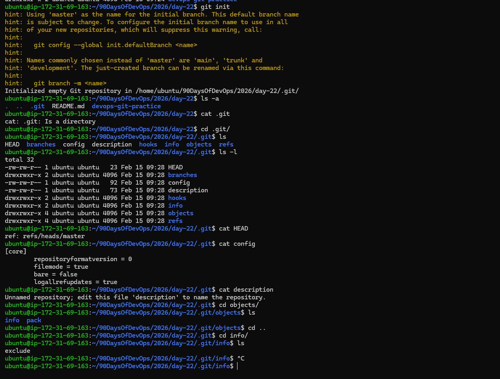
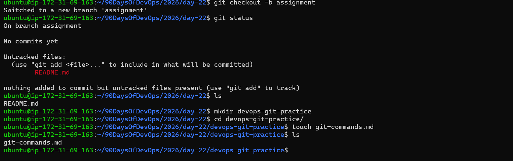
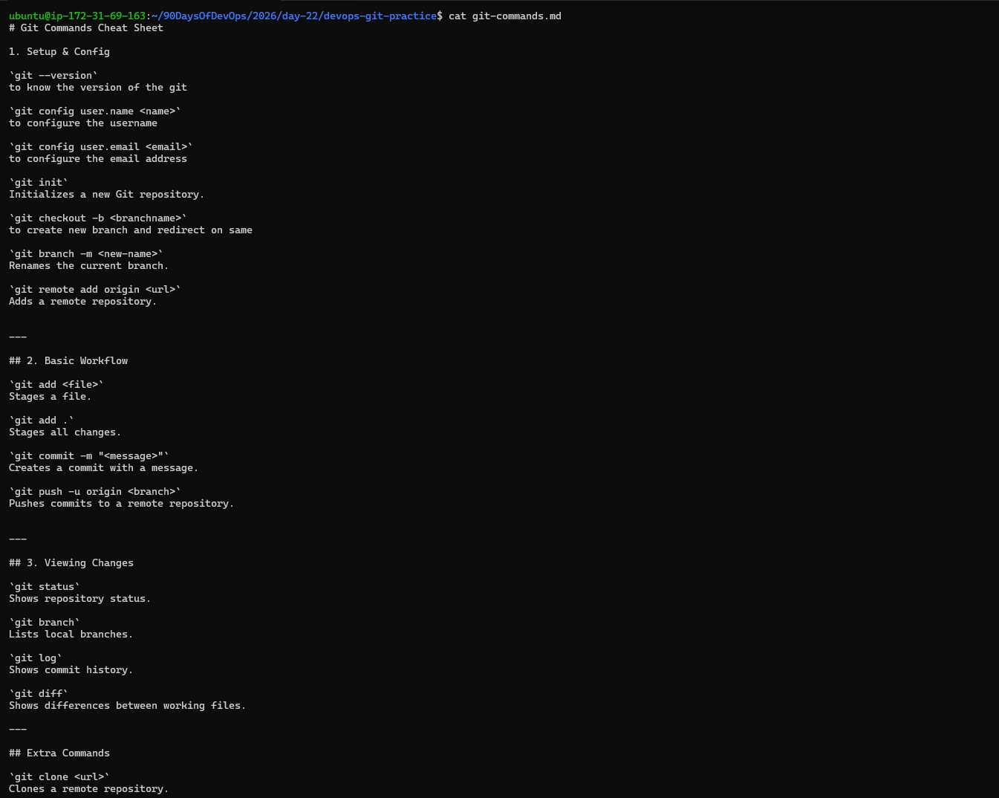
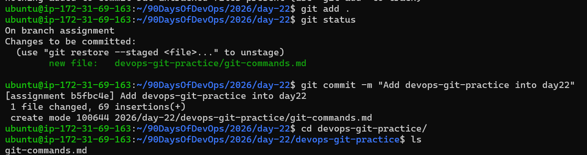
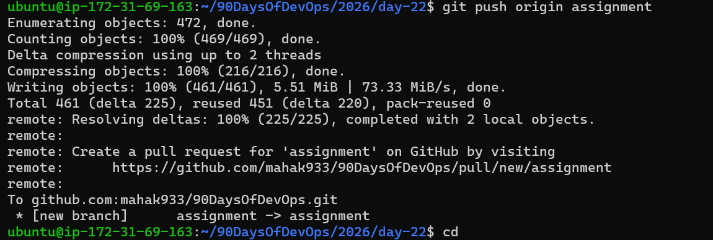

## Challenge Tasks
------

- Task 1: Install and Configure Git

1.Verify Git is installed on your machine
2.Set up your Git identity — name and email
3.Verify your configuration





-------

- Task 2: Create Your Git Project
  
1.Create a new folder called `devops-git-practice`
2.Initialize it as a Git repository
3.Check the status — read and understand what Git is telling you
4.Explore the hidden .git/ directory — look at what's inside





------

- Task 3: Create Your Git Commands Reference
  
1.Create a file called git-commands.md inside the repo
2.Add the Git commands you've used so far, organized by category:
3.Setup & Config
4.Basic Workflow
5.Viewing Changes
6.For each command, write:
7.What it does (1 line)
8.An example of how to use it





-------

- Task 4: Stage and Commit
  
1.Stage your file
2.Check what's staged
3.Commit with a meaningful message
4.View your commit history



--------

- Task 5: Make More Changes and Build History
  
1.Edit git-commands.md — add more commands as you discover them
2.Check what changed since your last commit
3.Stage and commit again with a different, descriptive message
4.Repeat this process at least 3 times so you have multiple commits in your history
5.View the full history in a compact format



---------

- Task 6: Understand the Git Workflow

1.What is the difference between git add and git commit?

`git add` - Moves changes to staging area and used to mark files to include in commit

`git commit` - Saves staged changes to project history and used to save changes permanently

2.What does the staging area do? Why doesn't Git just commit directly?

The staging area (also called the index) is a temporary holding area for changes you want to include in your next commit. It allows you to:
- **Select specific changes** - You can choose which files or parts of files to commit, not everything you've modified
- **Review before committing** - Check what will be committed with `git diff --staged`
- **Organize logical commits** - Group related changes together even if you've modified multiple files
- **Undo before committing** - Remove files from staging with `git reset` if you change your mind

Why not commit directly? Because it gives you control and flexibility. Without staging, every single change would be committed together, making history messy and hard to track. The staging area lets you create clean, organized, logical commits that tell a story about your work.

3.What information does git log show you?

`git log` displays the commit history of your repository. It shows:
- **Commit hash** - A unique identifier (SHA-1) for each commit
- **Author** - Who made the commit (name and email)
- **Date** - When the commit was made
- **Commit message** - The description of what was changed

Example output:
```
commit a3c5f8d9e2b1c4f6a7b8c9d0e1f2a3b4c5d6e7f8
Author: Your Name <your.email@example.com>
Date:   Mon Feb 16 10:30:45 2026 +0000

    Add image links to day 22 notes
```

Useful `git log` commands:
- `git log --oneline` - Compact format showing just hash and message
- `git log --graph --oneline --all` - Visual branch history
- `git log -n 5` - Show last 5 commits
- `git log --author="Name"` - Filter by author
- `git log --since="2 weeks ago"` - Filter by date range

4.What is the .git/ folder and what happens if you delete it?

5.What is the difference between a working directory, staging area, and repository?
Ongoing Task

6.Keep updating git-commands.md every day as you learn new Git commands in the upcoming days. This will become your personal Git reference. Maintain a clean commit history — one commit per update with a clear message.


