## Challenge Tasks

### Task 1: Git Merge — Hands-On
1. Create a new branch `feature-login` from `main`, add a couple of commits to it
2. Switch back to `main` and merge `feature-login` into `main`

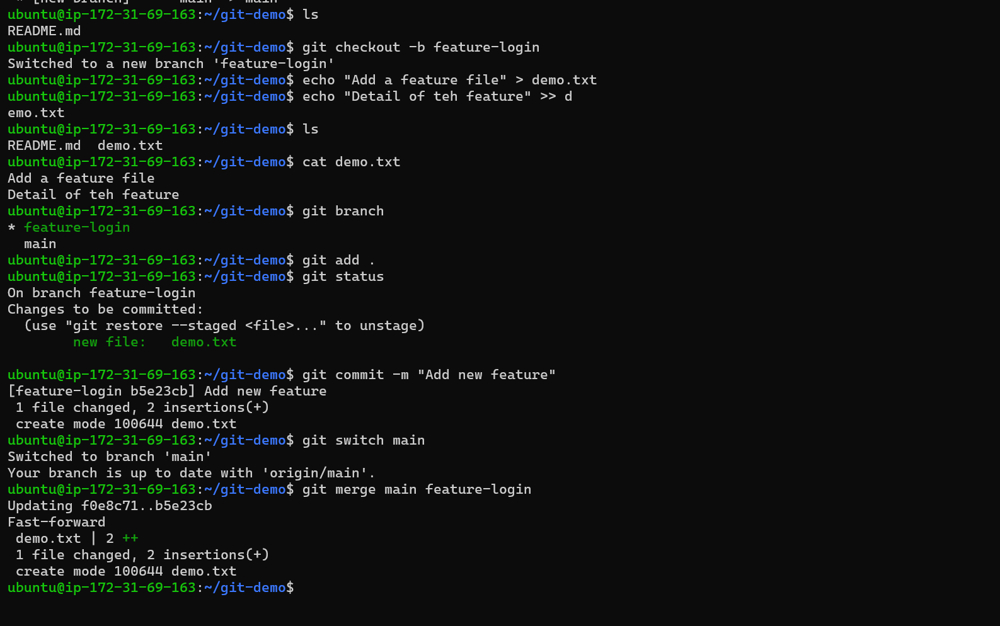

3. Observe the merge — did Git do a **fast-forward** merge or a **merge commit**?
`Fast‑forward ` No merge commit, linear history
`Merge commit` mergeMerge commit with two parents

4. Now create another branch `feature-signup`, add commits to it — but also add a commit to `main` before merging
5. Merge `feature-signup` into `main` — what happens this time?

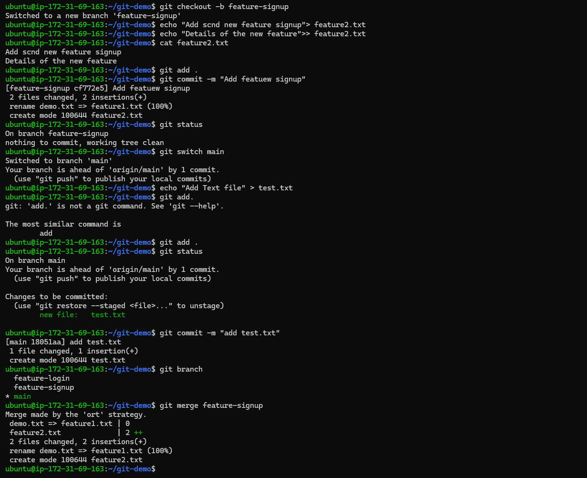

6. Answer in your notes:
   - What is a fast-forward merge?
   `Fast‑forward merge` : Git just moves the branch pointer forward (no merge commit)
   - When does Git create a merge commit instead?
    `Merge commit`: Git creates a new commit because history diverged
   - What is a merge conflict? (try creating one intentionally by editing the same line in both branches)
    `Merge conflict`: Files changed differently in both branches at same line and Git cannot auto-merge
---

### Task 2: Git Rebase — Hands-On
1. Create a branch `feature-dashboard` from `main`, add 2-3 commits
2. While on `main`, add a new commit (so `main` moves ahead)

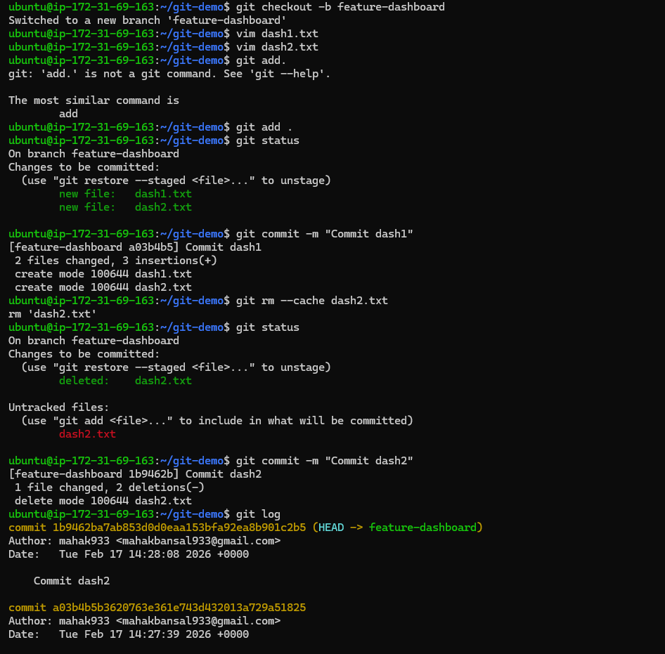

3. Switch to `feature-dashboard` and rebase it onto `main`

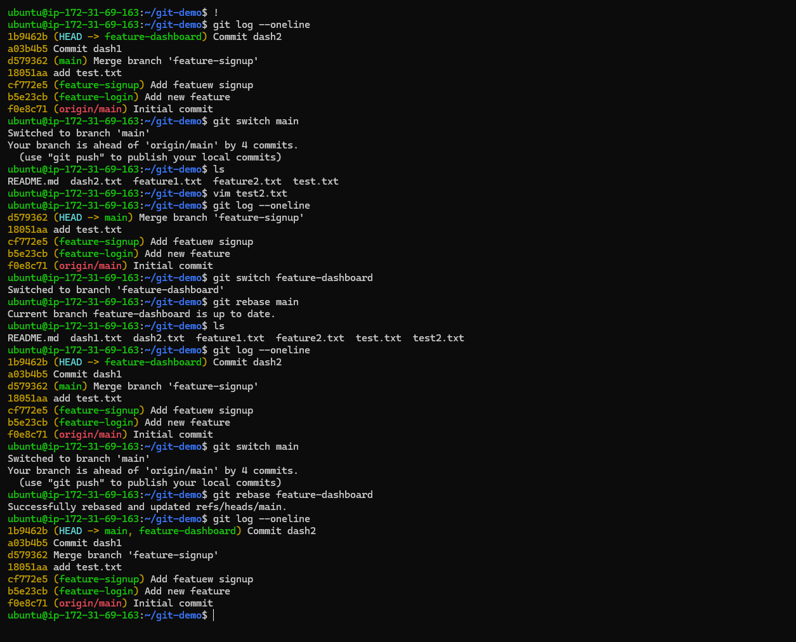

4. Observe your `git log --oneline --graph --all` — how does the history look compared to a merge?
`--oneline` Shows each commit in one short line

`--graph` Draws ASCII lines to show branching & merging

`--all` Shows all branches, not just the current one

5. Answer in your notes:
   - What does rebase actually do to your commits?

   Takes the commits from your branch ,Removes them from their original position re‑applies them on top of another branch

   - How is the history different from a merge?

    In merge History is non‑linear but preserves reality. where in rebase Looks like 
Linear, neat history

   - Why should you **never rebase commits that have been pushed and shared** with others?

    Deal with duplicated commits, Reset or re‑clone their branches and If others already built on that past, changing it breaks their work.

   - When would you use rebase vs merge?

   `Rebase` You want clean, linear history
You haven't pushed your branch yet
You want to “update your branch” with changes from main

'Merge` History must be preserved
You are working on a shared branch
The branch is already pushed
You want to capture the fact that two branches diverged and were merged

---

### Task 3: Squash Commit vs Merge Commit
1. Create a branch `feature-profile`, add 4-5 small commits (typo fix, formatting, etc.)
2. Merge it into `main` using `--squash` — what happens?

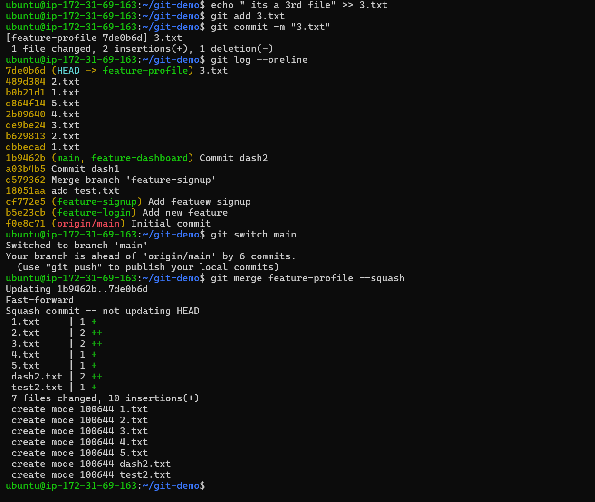

3. Check `git log` — how many commits were added to `main`?
4. Now create another branch `feature-settings`, add a few commits

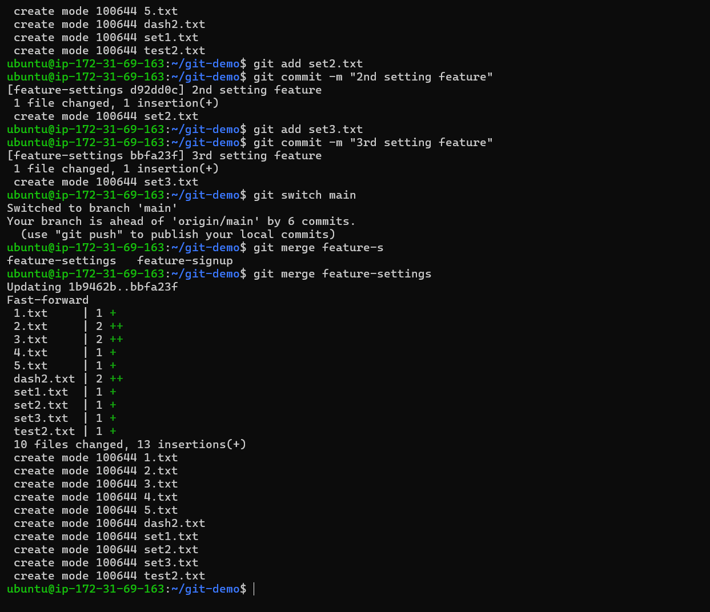

5. Merge it into `main` **without** `--squash` (regular merge) — compare the history

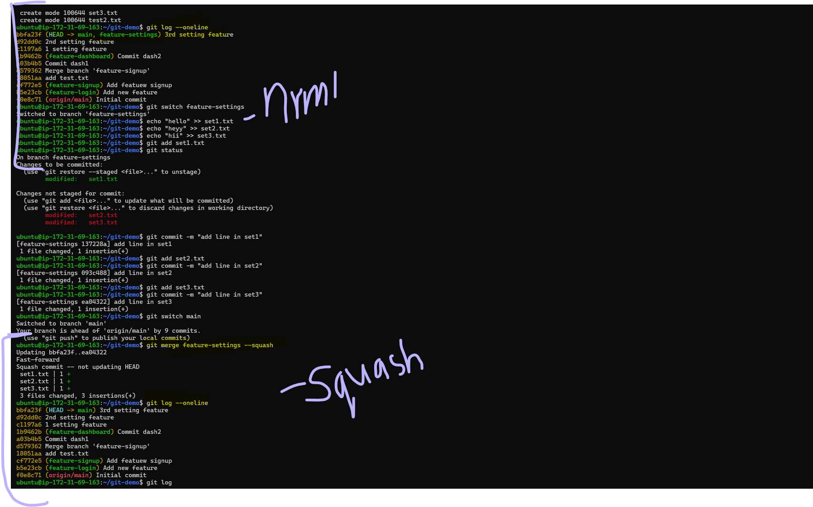

6. Answer in your notes:
   - What does squash merging do?
   A squash merge takes all the commits from a feature branch and combines them into a single commit when merging into the target branch (usually main).

   - When would you use squash merge vs regular merge?
   `Squash` : Combines all feature commits into 1 commit. Clean history, WIP commit cleanup,Loses detailed history
   `Regular` : Preserves all commits + adds merge commit. Traceability, teamwork,Messier history

   - What is the trade-off of squashing?
    `uses` : Cleaner, simpler commit history, One consolidated commit for the entire feature, Easy to revert (one   commit to undo)
    `Cons` : 
    1. Loses the original commit history
    2. Harder to trace bugs
    3. Makes collaboration history unclear
    4. Feature branch relation is lost

----

### Task 4: Git Stash — Hands-On
1. Start making changes to a file but **do not commit**
2. Now imagine you need to urgently switch to another branch — try switching. What happens?
3. Use `git stash` to save your work-in-progress

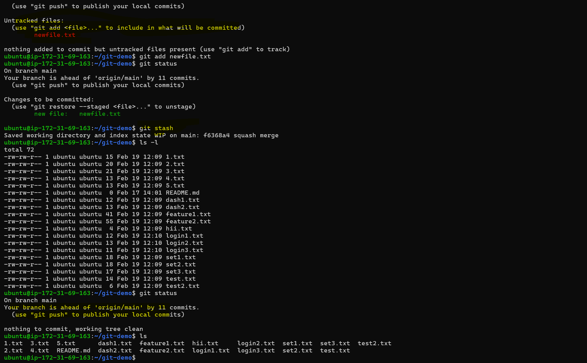

4. Switch to another branch, do some work, switch back
5. Apply your stashed changes using `git stash pop`

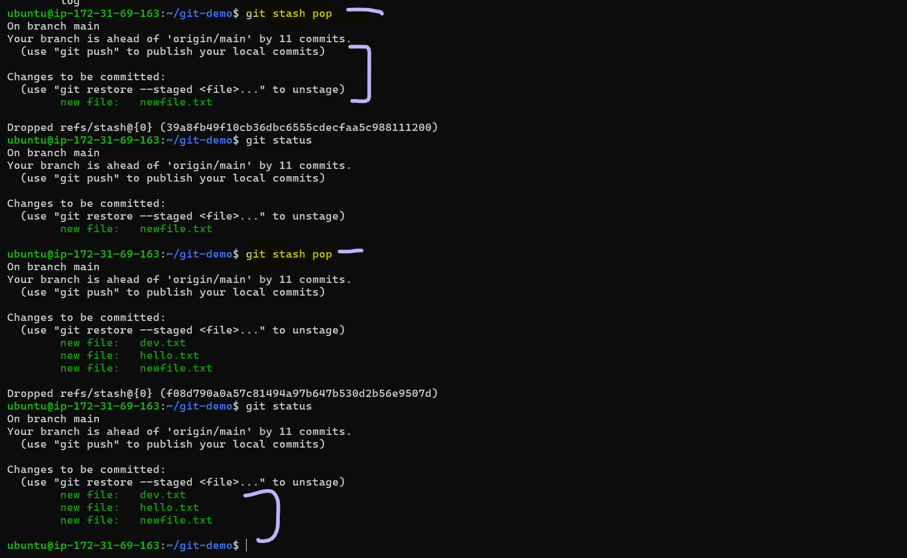

6. Try stashing multiple times and list all stashes
7. Try applying a specific stash from the list
8. Answer in your notes:
   - What is the difference between `git stash pop` and `git stash apply`?
   - When would you use stash in a real-world workflow?

---

### Task 5: Cherry Picking
1. Create a branch `feature-hotfix`, make 3 commits with different changes
2. Switch to `main`
3. Cherry-pick **only the second commit** from `feature-hotfix` onto `main`

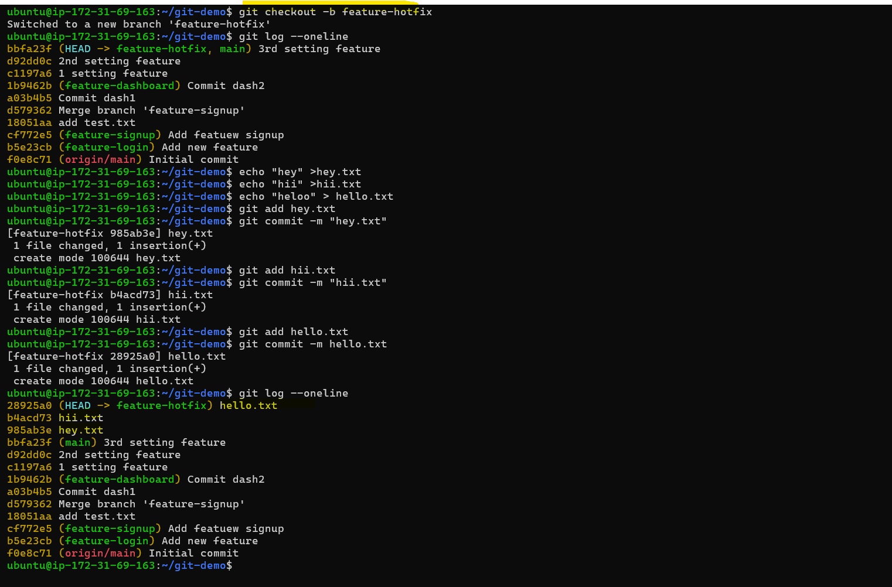

4. Verify with `git log` that only that one commit was applied

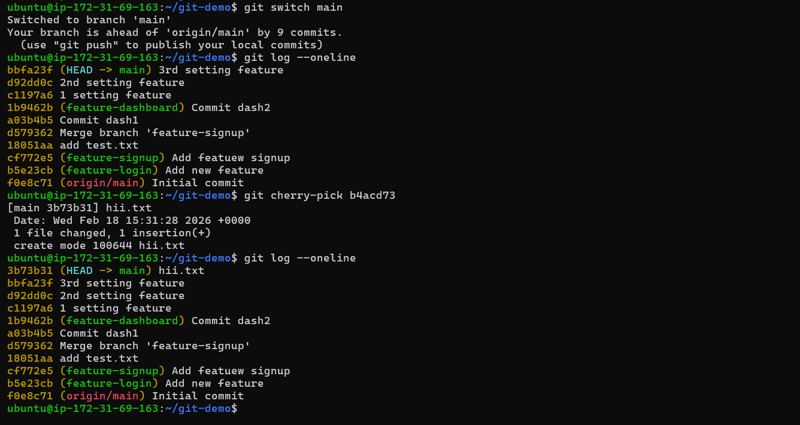

5. Answer in your notes:
   - What does cherry-pick do?
    Cherry-pick takes a single commit from multiple commits and merge them on your current branch.
    `git cherry-pick <commitid>`

   - When would you use cherry-pick in a real project?
    1. A specific commit from any branch without merging the whole branch
    2. Hotfix Needed in Main but Made on Another Branch
    3. Apply the Same Fix to Multiple Release Branches
    4. You Want ONE Commit But NOT the Entire Branch
    
   - What can go wrong with cherry-picking?
    1.Duplicate commits
    2.Confusing history
    3.More conflicts than a merge
    4.Repeated conflicts
    5.Missing dependent commits
    6.Harder debugging
