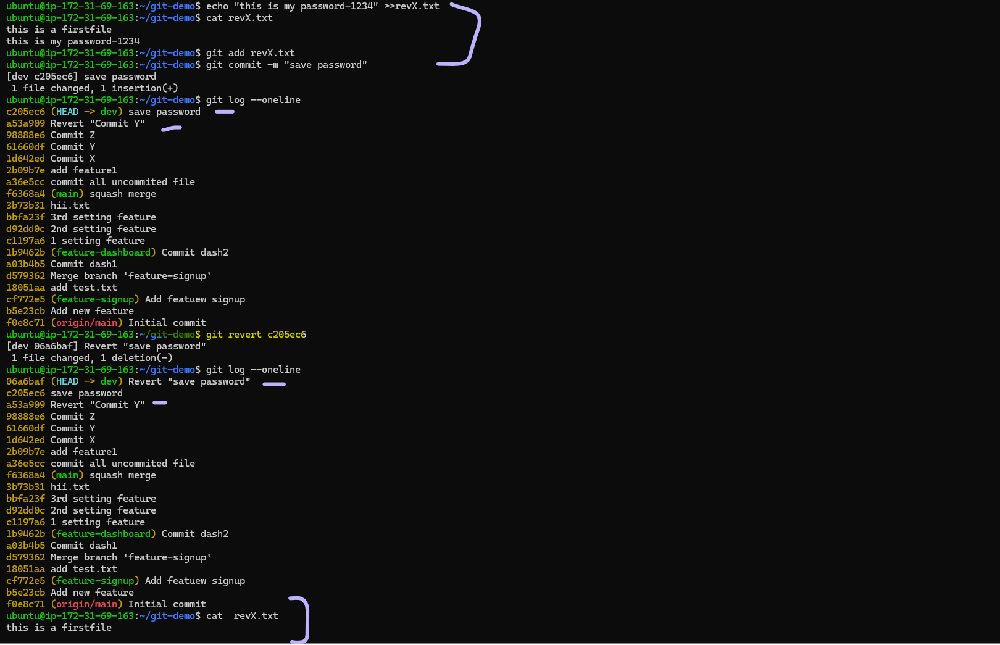

## Challenge Tasks

### Task 1: Git Reset — Hands-On
1. Make 3 commits in your practice repo (commit A, B, C)
2. Use `git reset --soft` to go back one commit — what happens to the changes?

.png)

3. Re-commit, then use `git reset --mixed` to go back one commit — what happens now?

.png)

4. Re-commit, then use `git reset --hard` to go back one commit — what happens this time?

.png)

5. Answer in your notes:
   - What is the difference between `--soft`, `--mixed`, and `--hard`?
    `--soft` → “Move HEAD only”
    Undo the commit, but keep all your changes staged (ready to commit).

    `--mixed` (default) → “Unstage, but keep changes”
    Undo the commit and unstage the changes, but keep your changes in the working folder.

    `--hard` → “Delete everything”
    Undo the commit AND delete all changes completely.

   - Which one is destructive and why?
    `--hard` is destructive Because it deletes your changes permanently — both:
    The commits you reset
    AND the local file changes in your working directory

   - When would you use each one?
   `--soft` → redo commits
    Use when you want to change or combine commits but keep all your changes staged.
    `--mixed` (default) → unstage but keep changes
    Use when you want to fix what was staged or restart staging, while keeping your file    changes.
    `--hard` → throw away everything
    Use when you want a complete reset and don’t need your changes anymore.

   - Should you ever use `git reset` on commits that are already pushed?
   git reset rewrites history, and if the commits are already pushed, other people may have pulled them. Changing history will break their copies and cause conflicts.
   `If pushed → DO NOT reset. Revert instead.`

---

### Task 2: Git Revert — Hands-On
1. Make 3 commits (commit X, Y, Z)
2. Revert commit Y (the middle one) — what happens?
3. Check `git log` — is commit Y still in the history?

4. Answer in your notes:
   - How is `git revert` different from `git reset`?
    ✅ git revert
    Makes a new commit that undoes an earlier commit.
    Does NOT delete history.
    Safe for pushed/shared branches.

    ❌ git reset
    Moves the branch pointer backwards to an earlier commit.
    Can remove commits from history (local branch only).
    NOT safe for shared/pushed branches (rewrites history).
    Used for cleaning up local work before pushing.

   - Why is revert considered **safer** than reset for shared branches?
    Instead of deleting or modifying old commits, git revert adds a new commit that undoes the previous change.
    This means everyone else’s history stays the same — no conflicts, no broken clones.

   - When would you use revert vs reset?
    ✅ Use git revert when:
    1.The commit is already pushed to a shared branch
    2.You want to undo a change safely
    3.You don’t want to break anyone else's work
    4.You want to preserve history
    5.You’re working in a team

    ✅ Use git reset when:
    1.You are working locally
    2.The commits are NOT pushed anywhere
    3.You want to remove or rewrite commits
    4.You want to fix mistakes before pushing
    5.You want to clean up your local history

---

### Task 3: Reset vs Revert — Summary
Create a comparison in your notes:

| | `git reset` | `git revert` |
|---|---|---|
| What it does | Moves the branch backward like the commit never happened | Makes a new commit that undoes the old one |
| Removes commit from history? | Yes (deletes it from your branch history)  | No (keeps history, just adds an “undo” commit) |
| Safe for shared/pushed branches? | Not safe (changes history → others get confused) | Safe (doesn’t change history) |
| When to use | When fixing your own local mistakes before pushing | When undoing something that is already pushed |

---

### Task 4: Branching Strategies
Research the following branching strategies and document each in your notes with:
- How it works (short description)
Git Flow uses several long‑lived branches:
1.main (production-ready)
2.develop (next release)
3.feature/*, release/*, hotfix/* for different tasks nd so onn.

- A simple diagram or flow (text-based is fine)

main ────────●──────────────●─────── (production)
               \             \
                \             ● hotfix/*
                 \
develop ───●──────●────●──────────── (ongoing development)
            \       \
             \       ● release/*
              \
               ● feature/login

- When/where it's used
1.Large teams
2.Projects with scheduled releases
3.Teams needing clean structure and multiple branch types

- Pros and cons
`Pros`
1.Very organized
2.Great for managing releases
3.Keeps production stable

`Cons`
1.Too many branches → feels heavy
2.Slow for fast-moving startups

1. **GitFlow** — develop, feature, release, hotfix branches
2. **GitHub Flow** — simple, single main branch + feature branches
3. **Trunk-Based Development** — everyone commits to main, short-lived branches
4. Answer:
   - Which strategy would you use for a startup shipping fast? 
    **GitHub Flow**
    1.Only one main branch (main)
    2.Create small feature branches
    3.Open PR → quick review → merge
    4.Deploy anytime
    5.Super lightweight — perfect for fast iterations

   - Which strategy would you use for a large team with scheduled releases?
   **GitFlow**
    `main` → stable, production code
    `develop` → next release in progress
    `feature/*` → each feature gets its own branch
    `release/*` → prep for a release
    `hotfix/*` → urgent production fixes

   - Which one does your favorite open-source project use? (check any repo on GitHub)
    **GitHub Flow**:  GitHub Flow is simpler and safer.

---

### Task 5: Git Commands Reference Update
Update your `git-commands.md` to cover everything from Days 22–25:
- Merging & Rebasing
- Stash & Cherry Pick
- Reset & Revert
"DONE"

---