## Challenge Tasks

### Task 1: Install and Authenticate
1. Install the GitHub CLI on your machine
2. Authenticate with your GitHub account
3. Verify you're logged in and check which account is active
4. Answer in your notes: What authentication methods does `gh` support?

---

### Task 2: Working with Repositories
1. Create a **new GitHub repo** directly from the terminal — make it public with a README
2. Clone a repo using `gh` instead of `git clone`

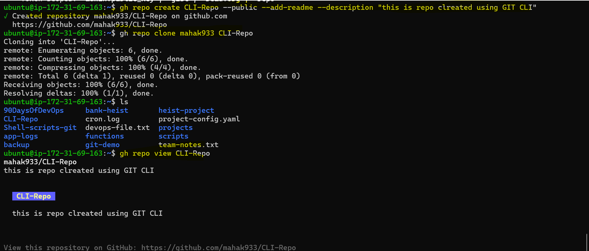

3. View details of one of your repos from the terminal
4. List all your repositories
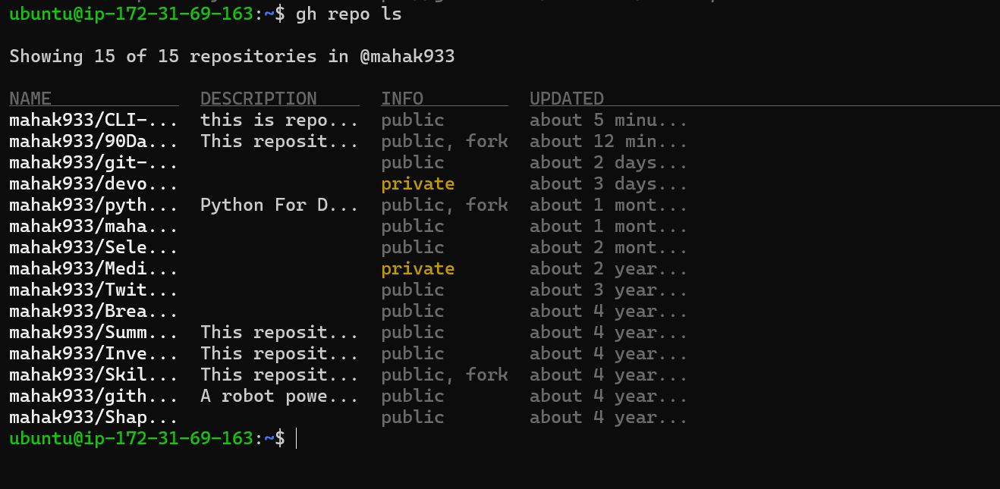

5. Open a repo in your browser directly from the terminal
6. Delete the test repo you created (be careful!)
.png)

---

### Task 3: Issues
1. Create an issue on one of your repos from the terminal — give it a title, body, and a label
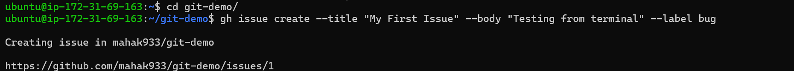

2. List all open issues on that repo
3. View a specific issue by its number
.png)

4. Close an issue from the terminal
.png)

.png)

5. Answer in your notes: How could you use `gh issue` in a script or automation?
Using gh issue in scripts/automation
You can use gh issue non‑interactively by setting an auth token (e.g., GH_TOKEN).
Then run it inside Bash/PowerShell/GitHub Actions to create, list, edit, or close issues automatically.
1. create an issue : `gh issue create --title "Bug found" --body "Details..." --label bug`
2. List issues: `gh issue list --json number,title --jq '.[].number'`
3. Edit an issue: `gh issue edit <issuenum> --add-label "investigating"`
4. Close issue: `gh issue close <issuenum> --comment "Fixed in latest build"`
---

### Task 4: Pull Requests
1. Create a branch, make a change, push it, and create a **pull request** entirely from the terminal
2. List all open PRs on a repo
3. View the details of your PR — check its status, reviewers, and checks
.png)
4. Merge your PR from the terminal
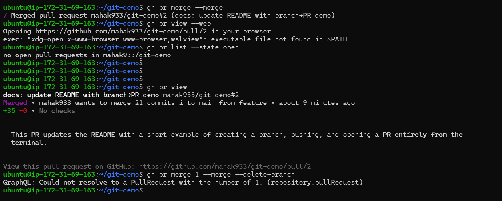
.png)

5. Answer in your notes:
   - What merge methods does `gh pr merge` support?
    gh pr merge lets you merge a pull request using three methods:
    1.Merge commit – adds a regular merge commit
    2.Squash merge – combines all commits into one before merging
    3.Rebase merge – rebases the PR’s commits onto the base branch

   - How would you review someone else's PR using `gh`?
    1.Check out the PR locally:

    gh pr checkout <pr-number>
    
    2.Read the changes: view files locally or run tests
    
    3.Leave comments:
    
    gh pr comment <number> --body "comment here"
    
    4.Submit a review:

    Approve: gh pr review <number> --approve    
    
    Request changes: gh pr review <number> --request-changes --body "reason"
    
    Comment-only review: gh pr review <number> --comment --body "notes"

---

### Task 5: GitHub Actions & Workflows (Preview)
1. List the workflow runs on any public repo that uses GitHub Actions
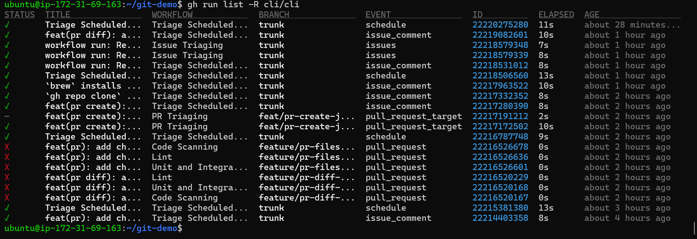

2. View the status of a specific workflow run
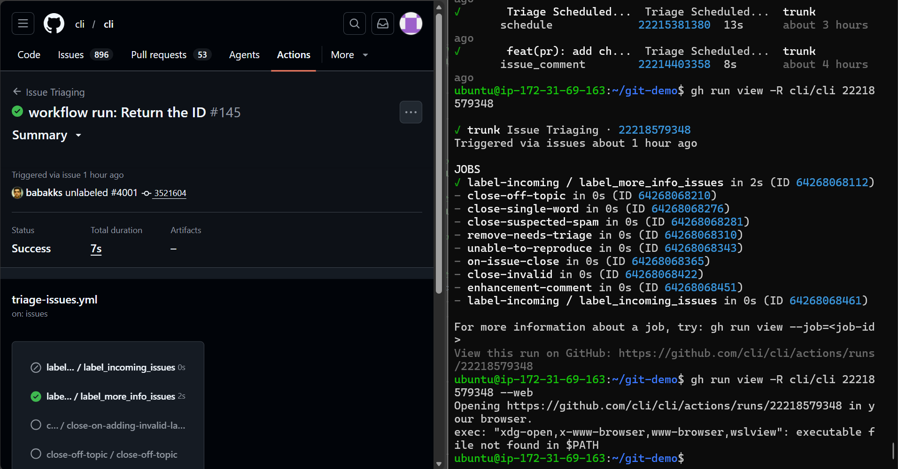

3. Answer in your notes: How could `gh run` and `gh workflow` be useful in a CI/CD pipeline?
`gh run`
Helps you control and inspect pipeline executions: rerun, monitor, fetch artifacts, automate retry logic.
`gh workflow`
Helps you control the pipeline definitions: list, enable/disable, dispatch, manage workflow files.

---

### Task 6: Useful `gh` Tricks
Explore and try these — add the ones you find useful to your `git-commands.md`:
1. `gh api` — make raw GitHub API calls from the terminal
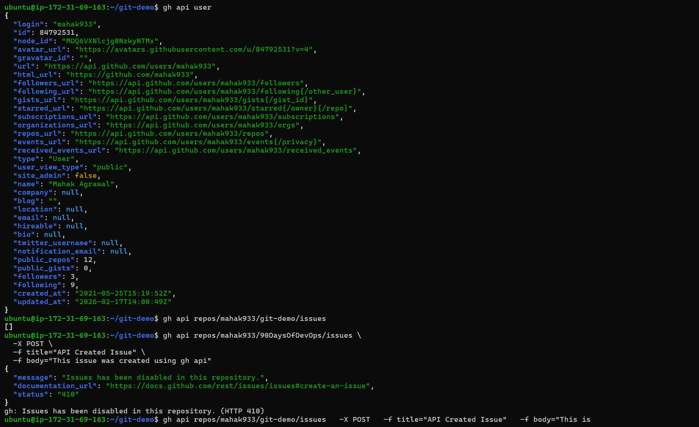
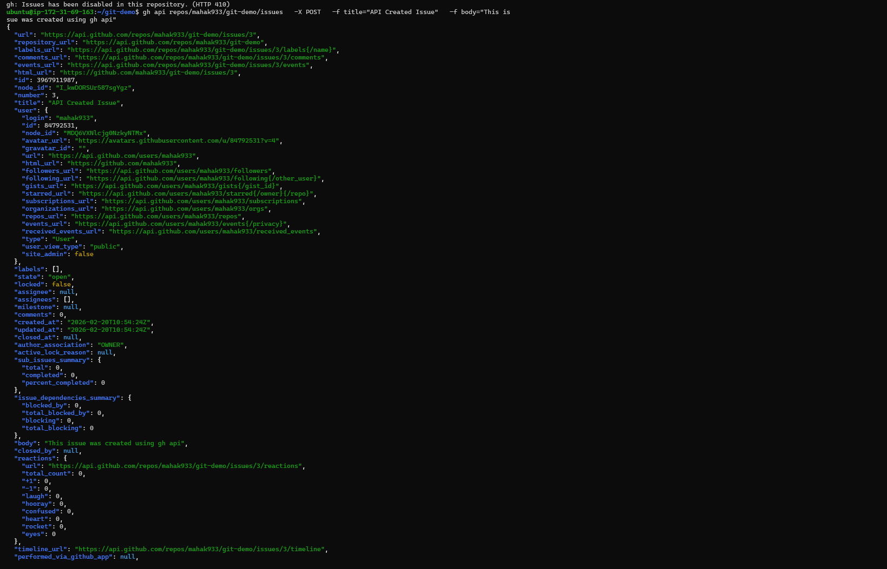
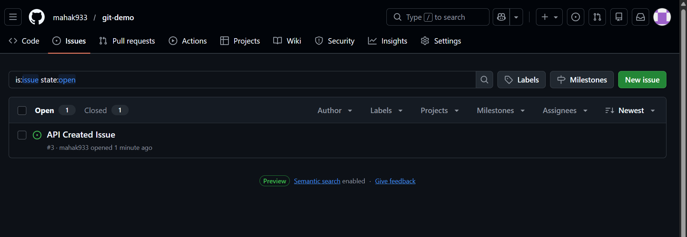

2. `gh gist` — create and manage GitHub Gists
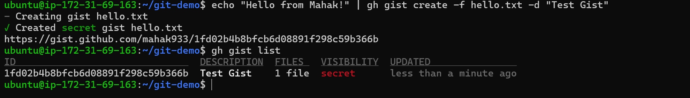
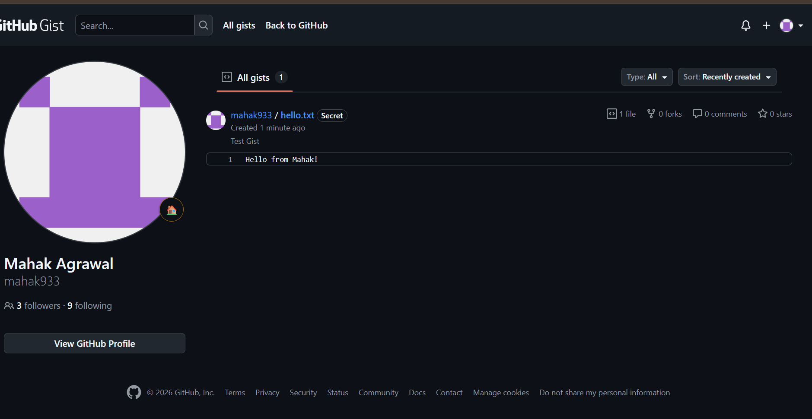

3. `gh release` — create and manage releases
4. `gh alias` — create shortcuts for commands you use often
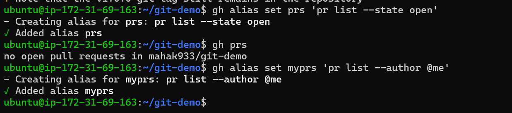

5. `gh search repos` — search GitHub repos from the terminal
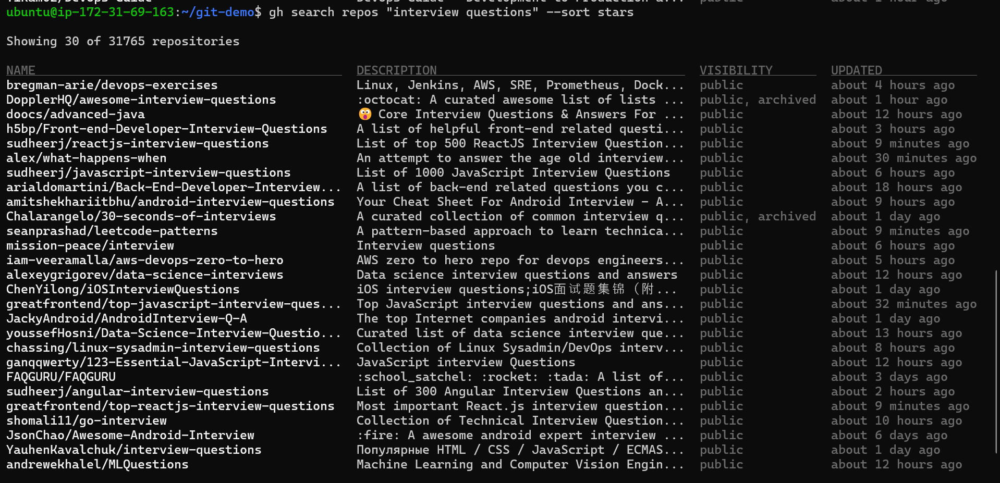
