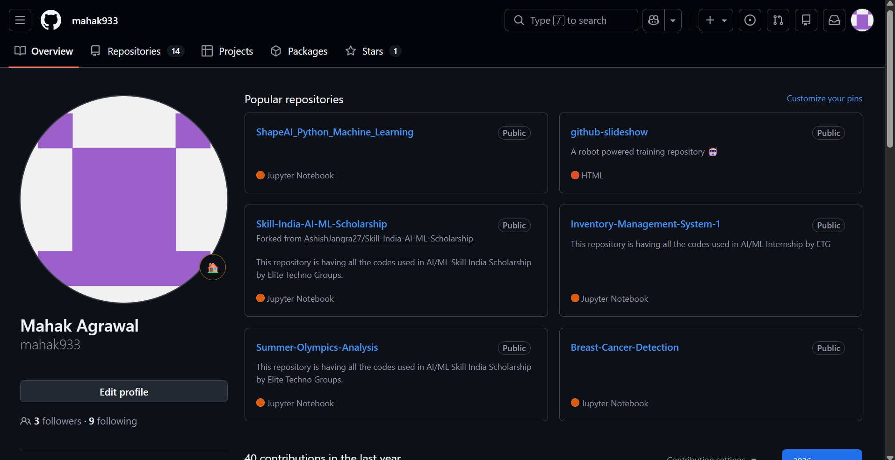
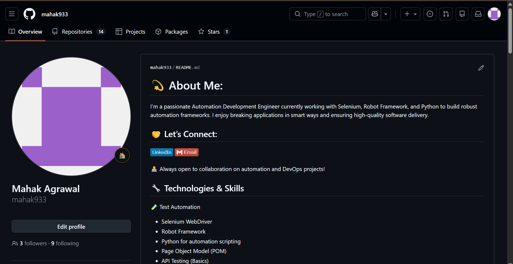

## Day 27 – GitHub Profile Makeover

### Profile Audit (Before Changes)

When I visited my profile as a recruiter, I noticed:

1.Profile was decent but not clearly structured

2.Bio did not strongly communicate my DevOps focus

3.Some repositories lacked proper descriptions

4.README files were inconsistent across repos

Overall impression: Active learner, but branding needed clarity and direction.

----

###  What I Improvedd ( After Changes)
✅ Created/Refined Profile README

1.Added a short professional introduction

2.Highlighted current focus (Cloud & DevOps)

3.Listed tech stack clearly

4.Added contact information

Why: Recruiters should understand who I am in 15 seconds.

---

### Before & After Screenshots

# Before

# After 

---

###  Key Learnings
GitHub is not just code storage — it's a developer portfolio.
Clarity > Quantity. Clean repos look more professional.
Presentation and structure matter as much as technical skills.

---

### Final Reflection
Today was not about coding — it was about identity. I moved from “just uploading code” to building a professional developer presence.
