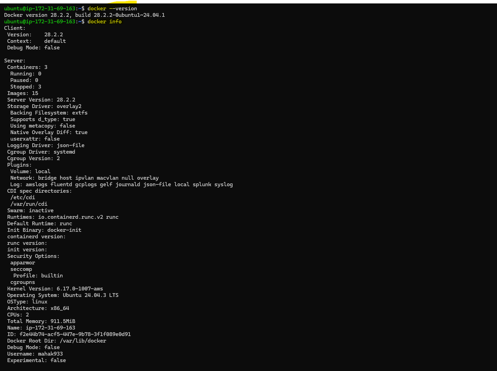
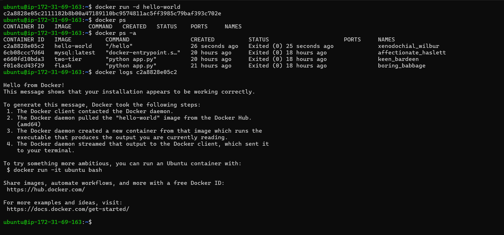
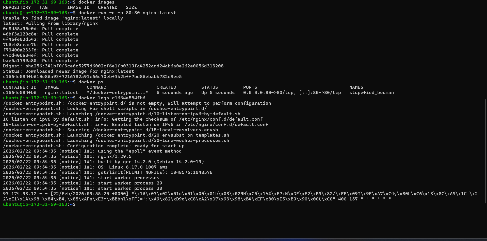
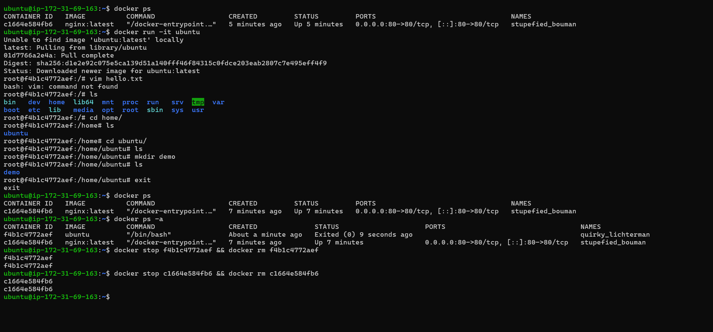
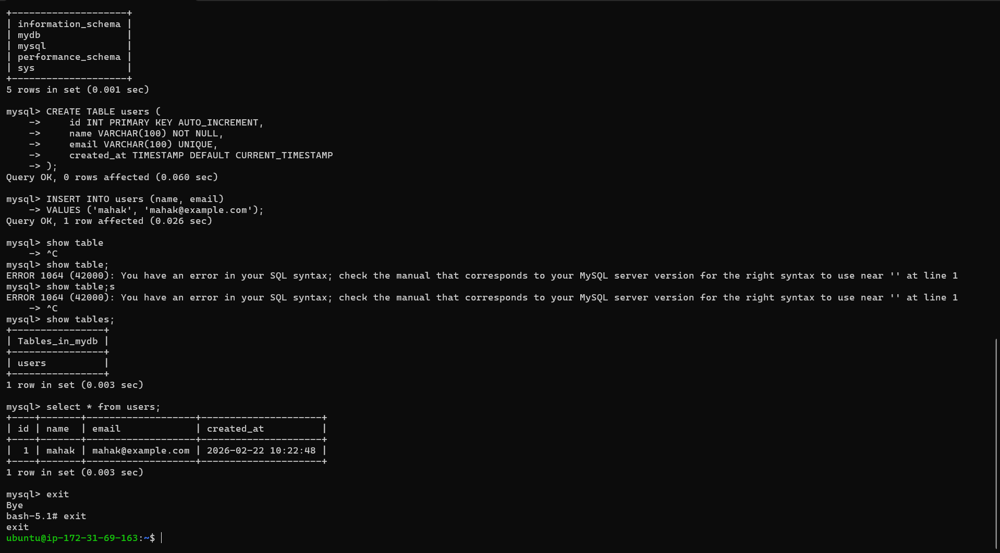
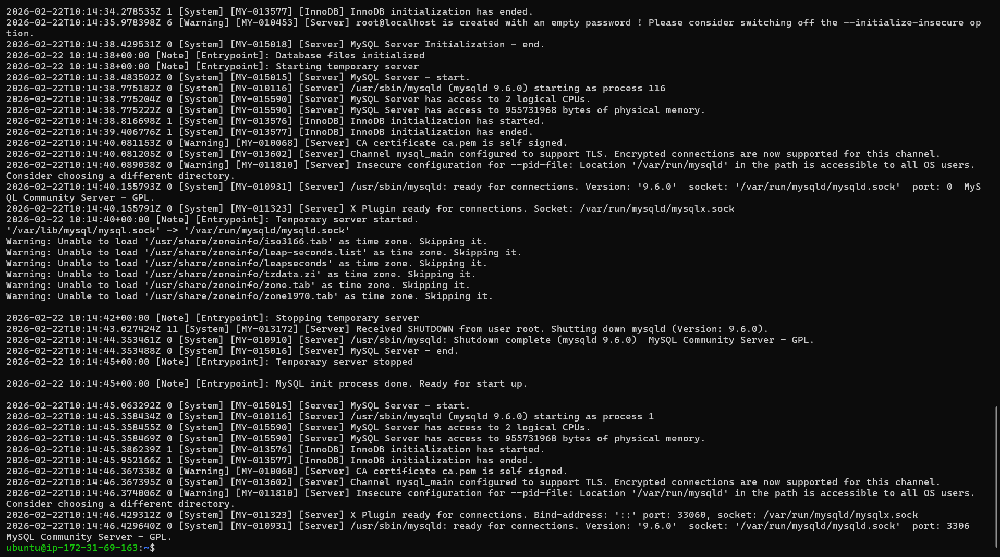

## Challenge Tasks

### Task 1: What is Docker?
Research and write short notes on:
- What is a container and why do we need them?

A container is a lightweight, standalone environment that packages an application with everything it needs — code, libraries, dependencies — so it runs the same everywhere.

- Containers vs Virtual Machines — what's the real difference?
  
`Containers`

1.Share the host OS kernel

2.Very lightweight (few MBs)

3.Start in milliseconds

4.Contain only the application + dependencies

5.Ideal for microservices and cloud-native apps

`Virtual Machines`

1.Have a full OS inside

2.Heavy (GBs)

3.Slow startup (seconds to minutes)

4.Good for running different OS types

5.More resource‑intensive

- What is the Docker architecture? (daemon, client, images, containers, registry)

1. Docker Client (docker command)

 The CLI tool you use

 Sends commands to the daemon

 Example: docker run, docker build

2. Docker Daemon (dockerd)
 
 Background service running on the host
 
 Does the actual work: build, run, stop containers
 
 Manages images and containers

3. Docker Images
 
 Read‑only templates
 
 Basis for creating containers
 
 Example: nginx:latest, python:3.11

4. Docker Containers
 
 Running instances of images
 
 Lightweight environments for apps

5. Docker Registry
 
 Stores and shares images
 
 Public: Docker Hub
 
 Private: AWS ECR, GCP Artifact Registry

- Draw or describe the Docker architecture in your own words.

             +--------------------------+
             |     Docker Client        |
             |   (docker commands)      |
             +------------+-------------+
                          |
                          v
             +--------------------------+
             |     Docker Daemon        |
             |   (build/run/stop apps)  |
             +------+--------+----------+
                    |        |
                    v        v
         +---------------+   +----------------+
         |   Images      |   |  Containers   |
         +---------------+   +----------------+
                    ^
                    |
         +-----------------------------+
         |     Docker Registry         |
         | (Docker Hub / Private Repo) |
         +-----------------------------+

---

### Task 2: Install Docker
1. Install Docker on your machine (or use a cloud instance)
2. Verify the installation

3. Run the `hello-world` container

4. Read the output carefully — it explains what just happened

---

### Task 3: Run Real Containers
1. Run an **Nginx** container and access it in your browser
2. Run an **Ubuntu** container in interactive mode — explore it like a mini Linux machine

3. List all running containers
4. List all containers (including stopped ones)
5. Stop and remove a container

---

### Task 4: Explore
1. Run a container in **detached mode** — what's different?

`docker run -d nginx`

2. Give a container a custom **name**

3. Map a **port** from the container to your host

`docker run -d -p 80:80 nginx:latest`

4. Check **logs** of a running container

`docker logs <ContainerID>`

5. Run a command **inside** a running container

---
