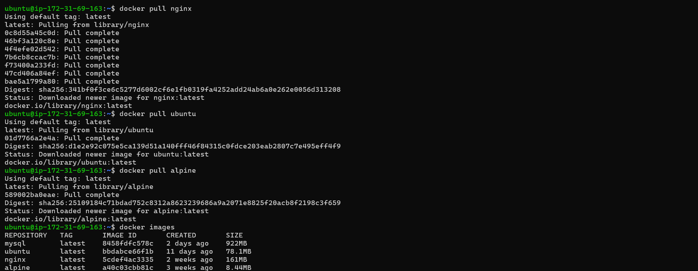
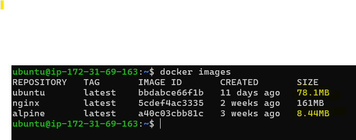
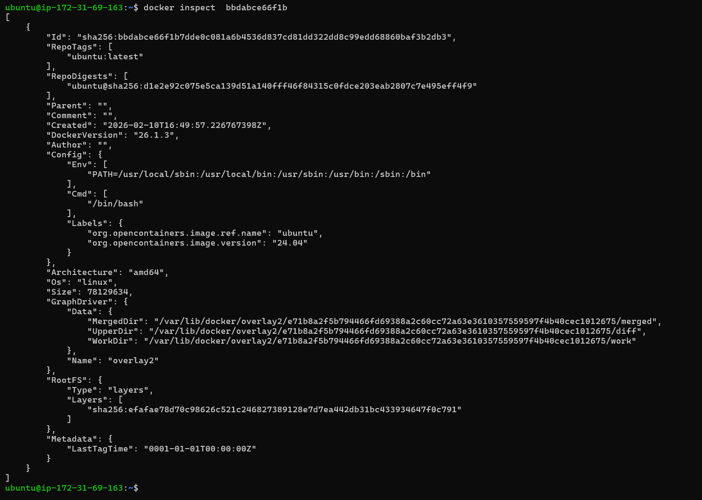
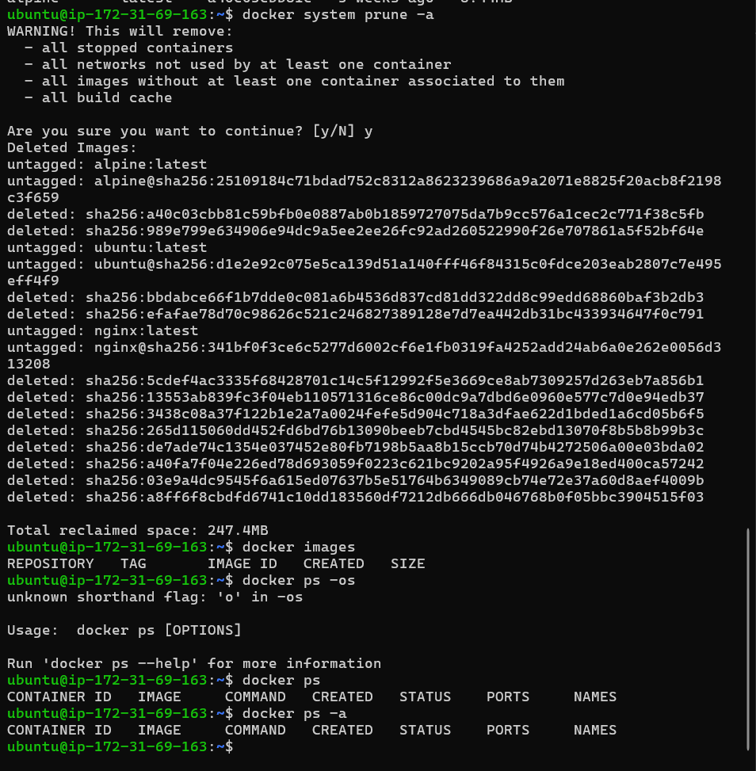
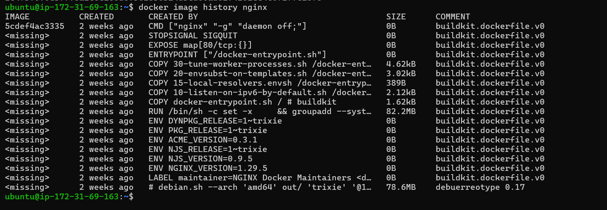
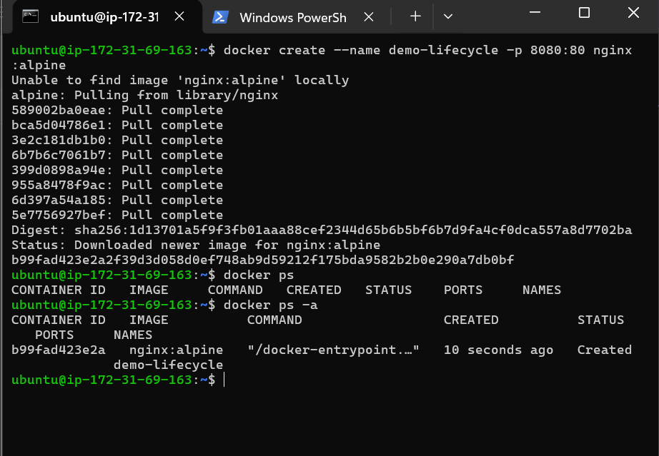
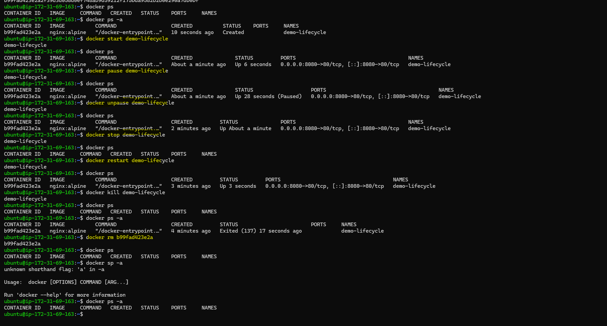
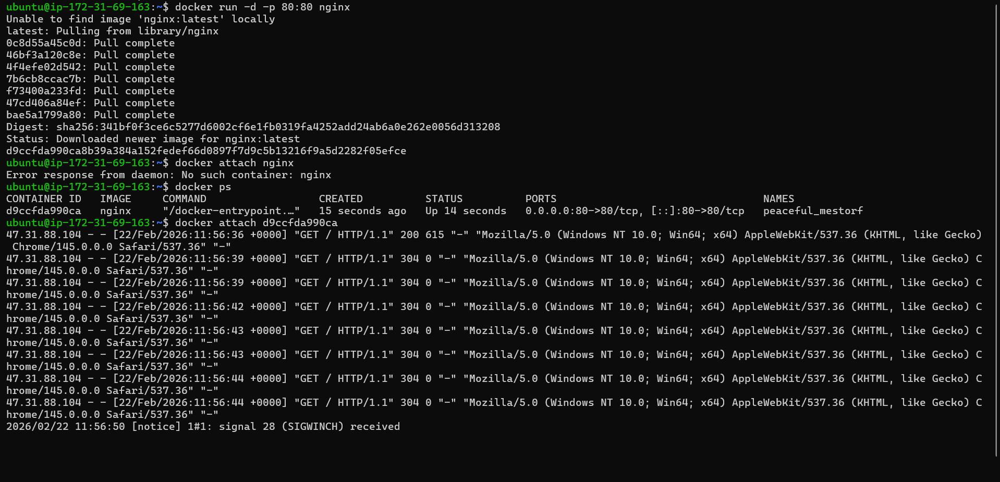
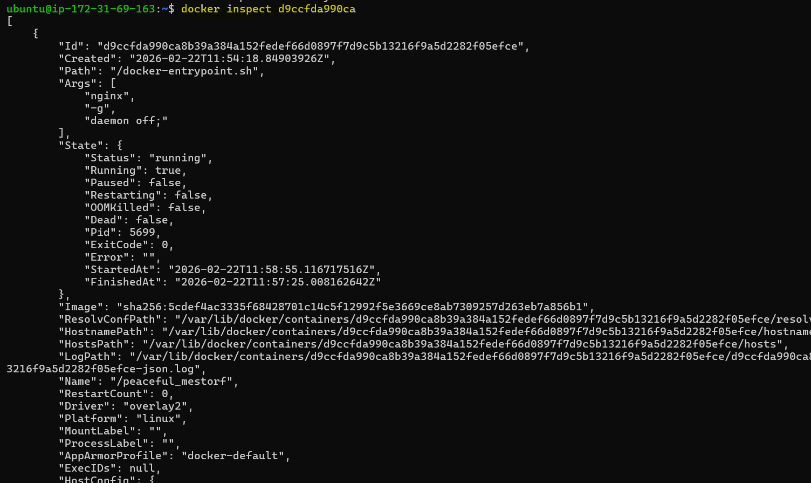
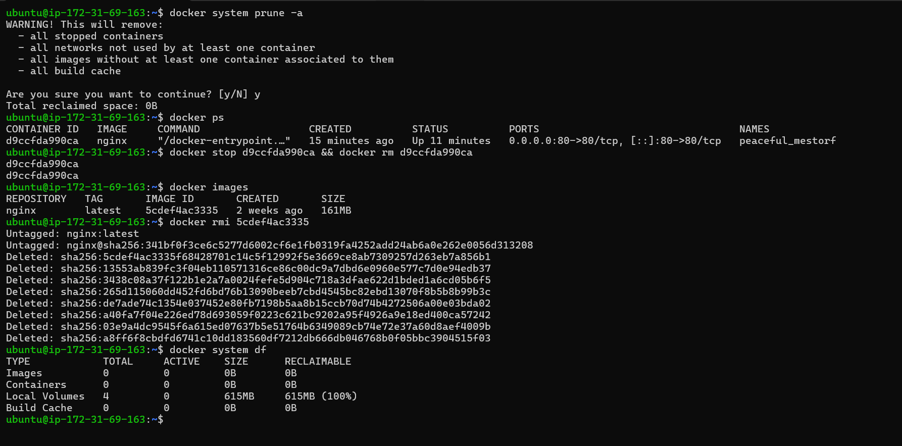

## Challenge Tasks

### Task 1: Docker Images
1. Pull the `nginx`, `ubuntu`, and `alpine` images from Docker Hub

2. List all images on your machine — note the sizes

3. Compare `ubuntu` vs `alpine` — why is one much smaller?

- Alpine is a minimal OS — Ubuntu is a full Linux distribution

`Alpine`

1.Designed specifically for containers, small VMs, embedded systems.
2.Includes only essential packages.
3.No unnecessary libraries, tools, or system services.
4.Minimal filesystem.

👉 Result: Tiny size (5–8 MB)

`Ubuntu`

1.A full general-purpose Linux distro.

Comes with:

1.GNU core utilities
2.bash shell
3.libc (GNU glibc)
4.system utilities
5.package managers
6.locale files
7.documentation

Much larger set of base libraries.

👉 Result: 70–100+ MB size

4. Inspect an image — what information can you see?

5. Remove an image you no longer need

---

### Task 2: Image Layers
1. Run `docker image history nginx` — what do you see?
2. Each line is a **layer**. Note how some layers show sizes and some show 0B

3. Write in your notes: What are layers and why does Docker use them?
`Layer` :A layer in Docker is a read‑only piece of a Docker image, created from each instruction in a Dockerfile.

Example :

1.FROM python:3.9     ➜ Layer 1

2.COPY app.py /app    ➜ Layer 2

3.RUN pip install -r requirements.txt ➜ Layer 3

4.CMD ["python", "app.py"] ➜ Layer 4

Each instruction = one layer.

⭐ Why does Docker use layers?

1. Reusability (Cache) : Docker reuses layers that have not changed.

Meaning:

1.If you rebuild an image but only app.py changed

2.Docker reuses all previous layers and builds only the changed layer

🎯 Builds become extremely fast

2. Saves Storage

If two images use the same base layer:

Image A: python:3.9

Image B: python:3.9

Docker stores that layer only once.

🎯 Saves disk space.

3. Faster Deployments

When pushing/pulling images to a registry:

Only changed layers are uploaded/downloaded

Unchanged layers are reused

🎯 Speeds up CI/CD pipelines.

4. Isolation & stability

Each layer is immutable (cannot be changed).

When a new change happens:

A new layer is created on top

Old layers remain untouched

🎯 Makes images more stable, repeatable, predictable.

5. Container creation becomes lightweight

Containers are created by adding a small read‑write layer on top of the image.

🎯 Fast container startup.

---

### Task 3: Container Lifecycle
Practice the full lifecycle on one container:
1. **Create** a container (without starting it)

2. **Start** the container
3. **Pause** it and check status
4. **Unpause** it
5. **Stop** it
6. **Restart** it
7. **Kill** it
8. **Remove** it

Check `docker ps -a` after each step — observe the state changes.

---

### Task 4: Working with Running Containers
1. Run an Nginx container in detached mode
2. View its **logs**
3. View **real-time logs** (follow mode)

4. **Exec** into the container and look around the filesystem
5. Run a single command inside the container without entering it

6. **Inspect** the container — find its IP address, port mappings, and mounts

.png)
.png)

---

### Task 5: Cleanup
1. Stop all running containers in one command
2. Remove all stopped containers in one command
3. Remove unused images
4. Check how much disk space Docker is using

---