## Challenge Tasks

### Task 1: The Problem
1. Run a Postgres or MySQL container
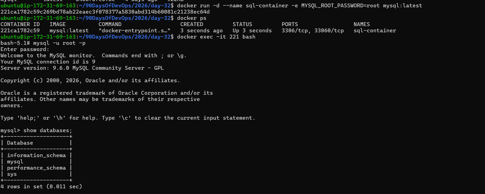

2. Create some data inside it (a table, a few rows — anything)
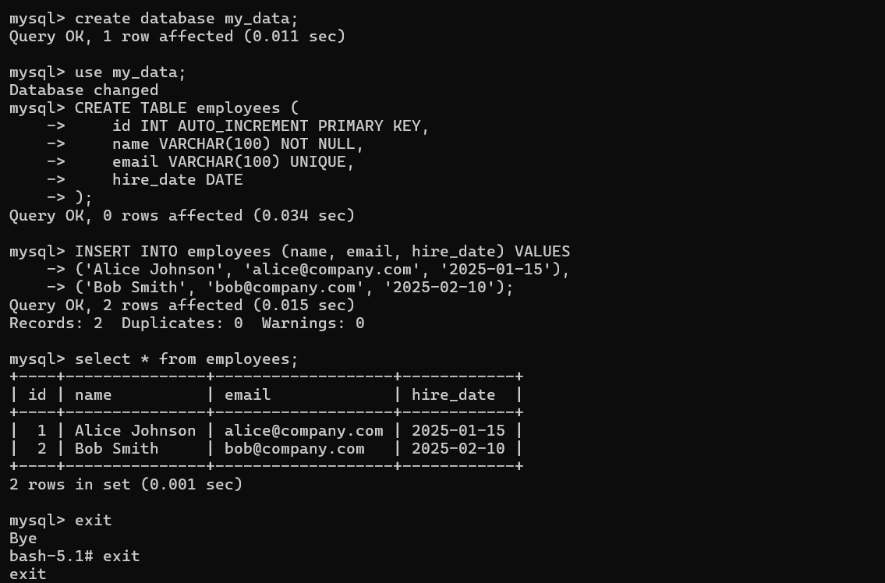

3. Stop and remove the container
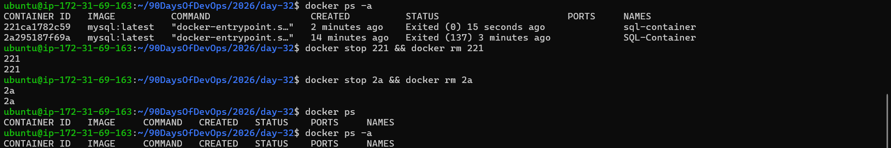

4. Run a new one — is your data still there?
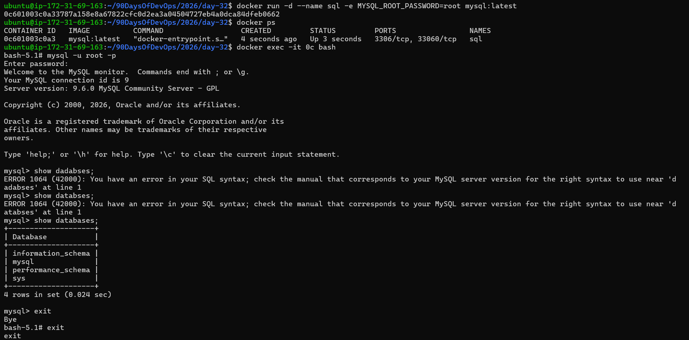

Write what happened and why.

✅ WHAT happened?
When you:

Ran a Postgres/MySQL container, Created a table and inserted data, Stopped and removed the container and Started a new fresh container

👉 Your data was gone.

The new container started empty again.

✅ WHY did this happen? 

Because:Containers do NOT store data permanently.
A container is like a temporary box.
When you delete the box, anything inside it is deleted too.
Data inside the container filesystem disappears when the container is removed.
So when you created a new container, it started from zero with no old data.

To keep data, you must use a volume.
Volumes save data outside the container, so even if the container is removed, the data stays safe.

---

### Task 2: Named Volumes
1. Create a named volume
`docker volume create mysql_volume`

2. Run the same database container, but this time **attach the volume** to it
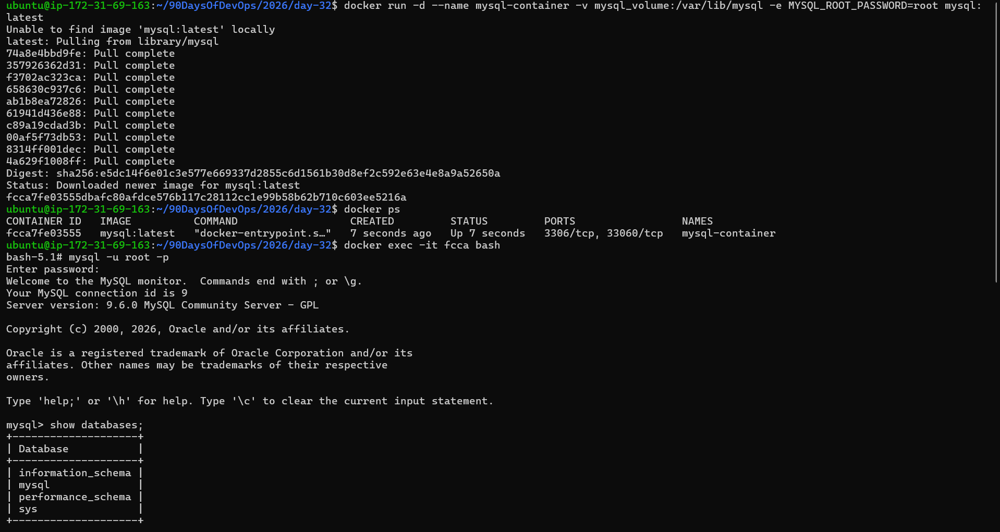

3. Add some data, stop and remove the container
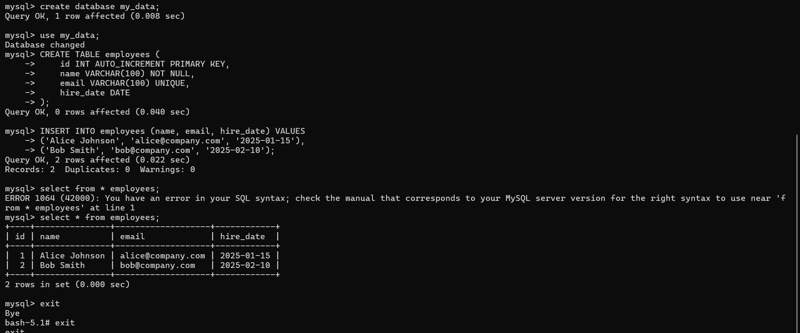
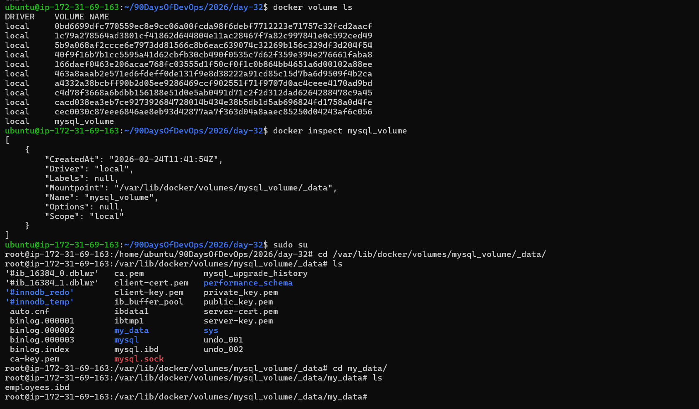

4. Run a brand new container with the **same volume**
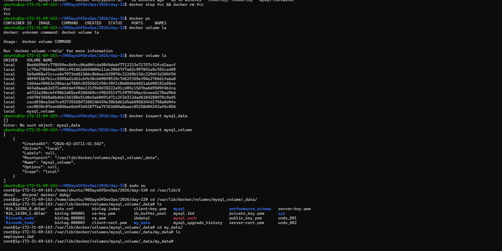
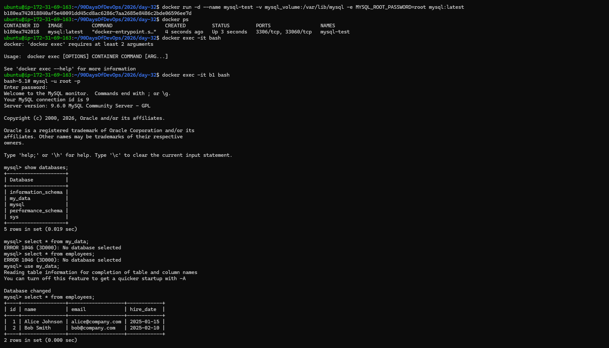

5. Is the data still there?

Yes, the data is still there.
Why:
Because a named volume stores the data outside the container, so when you delete the container and start a new one using the same volume, the new container can still see the old data.

**Verify:** `docker volume ls`, `docker volume inspect`

---

### Task 3: Bind Mounts
1. Create a folder on your host machine with an `index.html` file
2. Run an Nginx container and **bind mount** your folder to the Nginx web directory
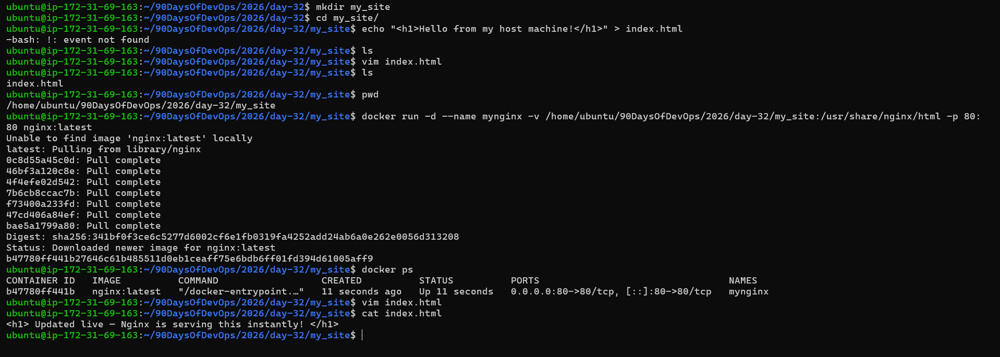

3. Access the page in your browser
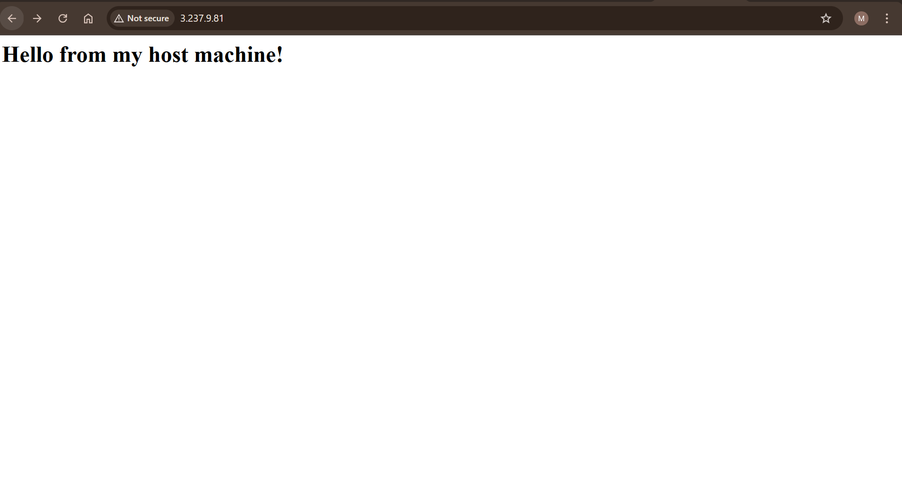

4. Edit the `index.html` on your host — refresh the browser

Write in your notes: What is the difference between a named volume and a bind mount?

`Named Volume` : Docker manages it

1. Docker stores the data in its own internal location
(/var/lib/docker/volumes/...)

2.You don’t choose the folder — Docker decides it.

3.You normally don’t edit the files directly.

4.Best for databases and production data.

Use case

MySQL, Postgres, Redis data that should survive container restarts.

`Bind Mount` : You manage it

1. You pick an exact folder on your host.

2. The container uses your actual files.

3. If you edit a file on your host → changes appear instantly in the container.

4. Best for development, where you want live editing.

Example

docker run -v /home/user/app:/app node

---

### Task 4: Docker Networking Basics
1. List all Docker networks on your machine
2. Inspect the default `bridge` network
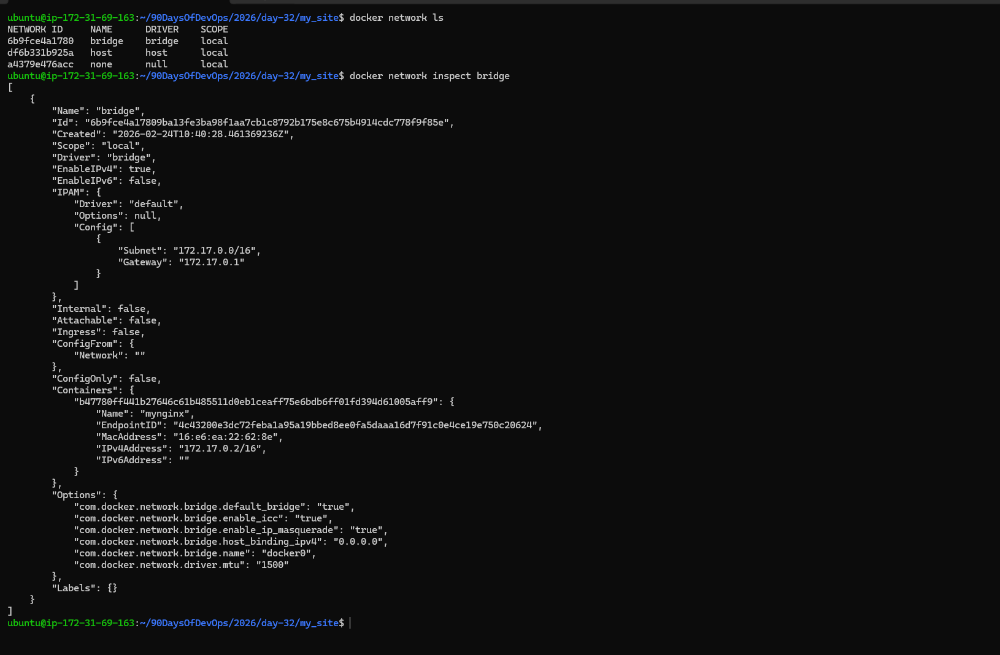

3. Run two containers on the default bridge — can they ping each other by **name**? `NO`
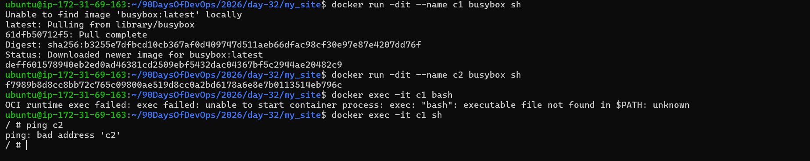

4. Run two containers on the default bridge — can they ping each other by **IP**?  `YES`
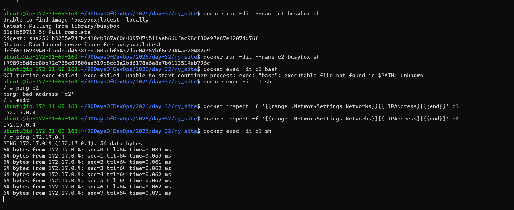

---

### Task 5: Custom Networks
1. Create a custom bridge network called `my-app-net`
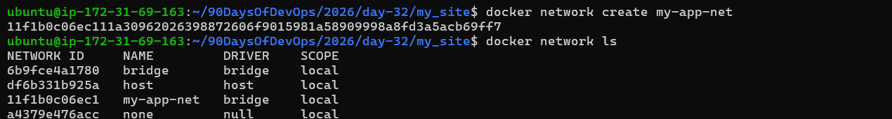

2. Run two containers on `my-app-net`
3. Can they ping each other by **name** now?
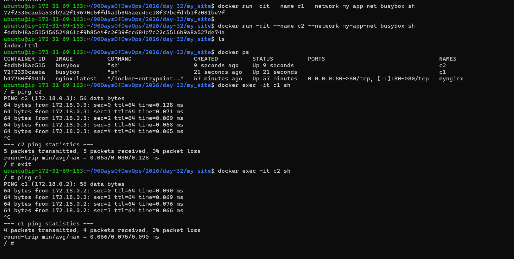

4. Write in your notes: Why does custom networking allow name-based communication but the default bridge doesn't?

`Default bridge` = old, basic network → no DNS → can’t ping by name

`Custom bridge` = modern network → DNS included → can ping by name

---

### Task 6: Put It Together
1. Create a custom network
2. Run a **database container** (MySQL/Postgres) on that network with a volume for data
3. Run an **app container** (use any image) on the same network
4. Verify the app container can reach the database by container name
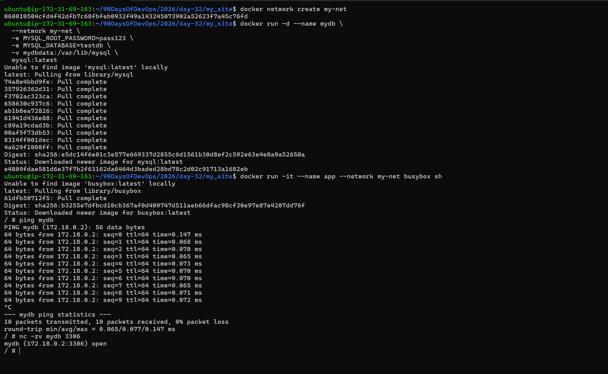

---