## Challenge Tasks

### Task 1: Install & Verify
1. Check if Docker Compose is available on your machine
2. Verify the version
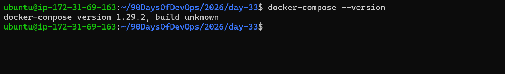

---

### Task 2: Your First Compose File
1. Create a folder `compose-basics`
2. Write a `docker-compose.yml` that runs a single **Nginx** container with port mapping
3. Start it with `docker compose up`
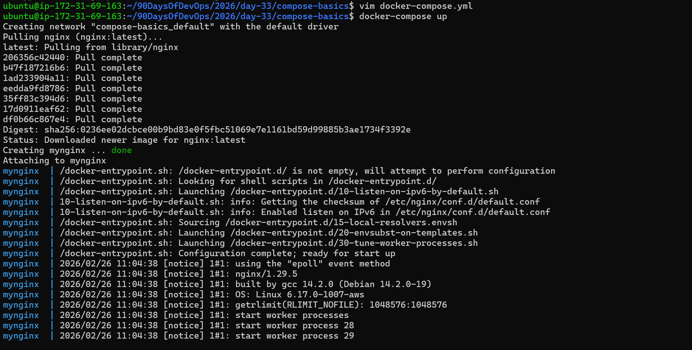

4. Access it in your browser

5. Stop it with `docker compose down`
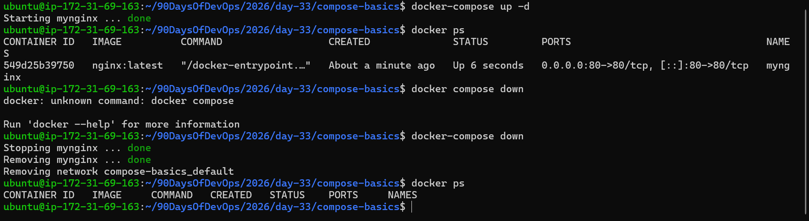

---

### Task 3: Two-Container Setup
Write a `docker-compose.yml` that runs:
- A **WordPress** container
- A **MySQL** container

They should:
- Be on the same network (Compose does this automatically)
- MySQL should have a named volume for data persistence
- WordPress should connect to MySQL using the service name
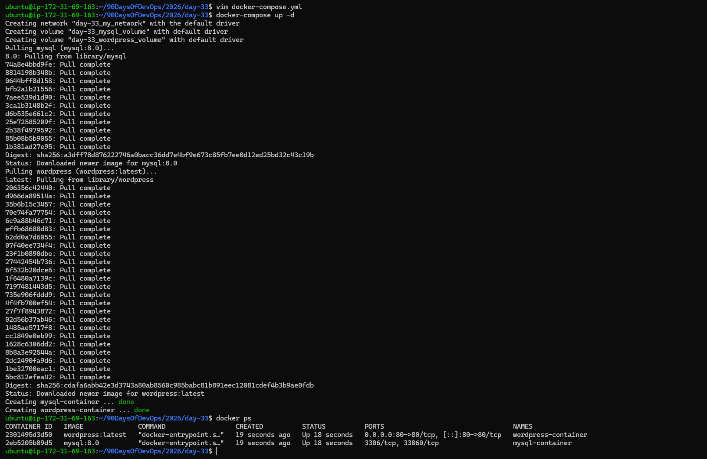
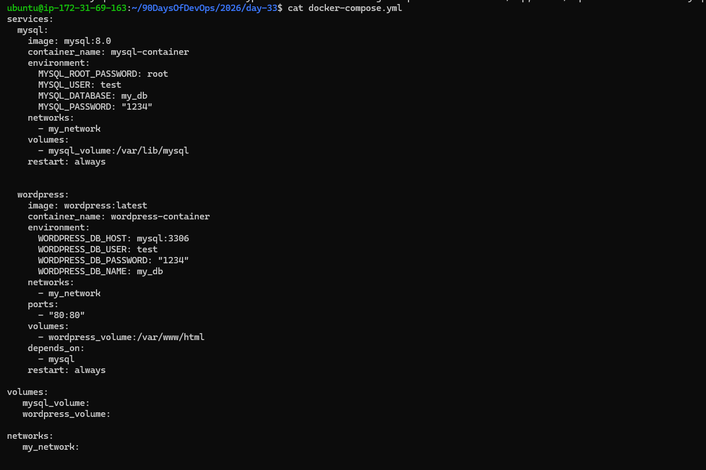

Start it, access WordPress in your browser, and set it up.
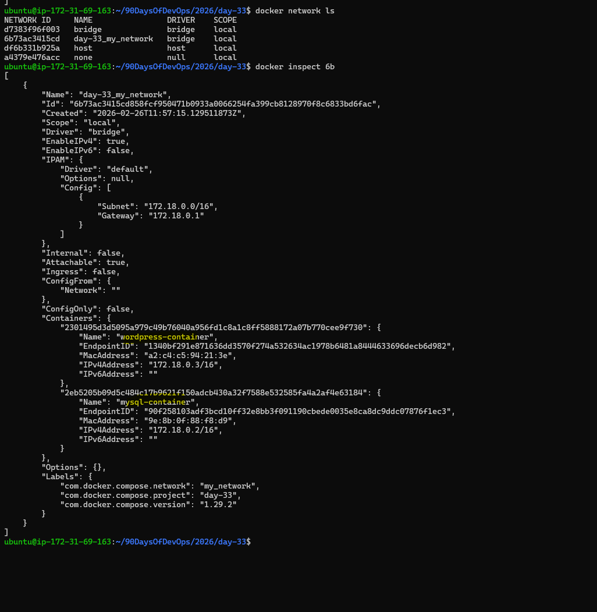

**Verify:** Stop and restart with `docker compose down` and `docker compose up` — is your WordPress data still there?

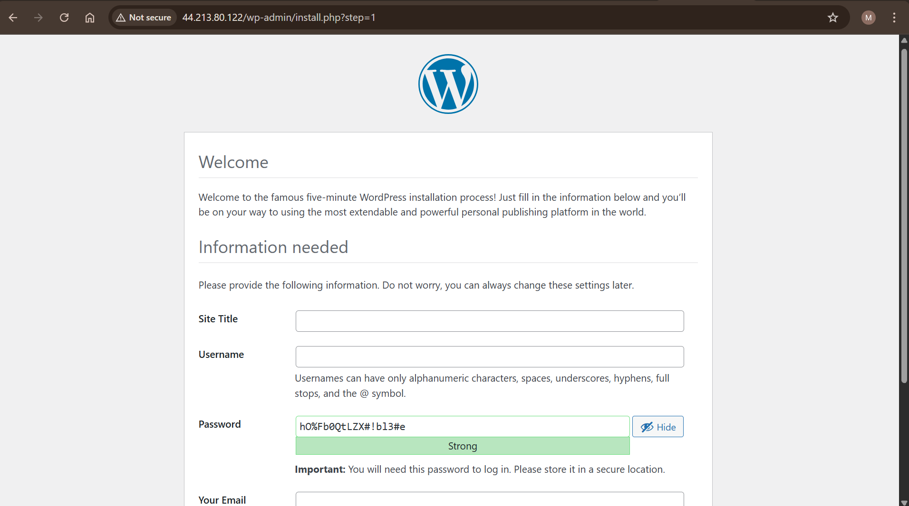
---

### Task 4: Compose Commands
Practice and document these:
1. Start services in **detached mode**
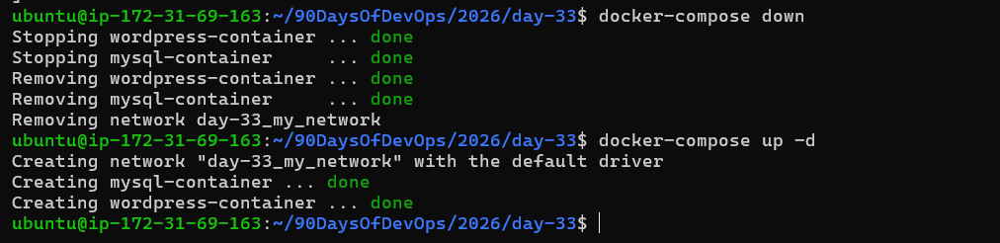

2. View running services
3. View **logs** of all services
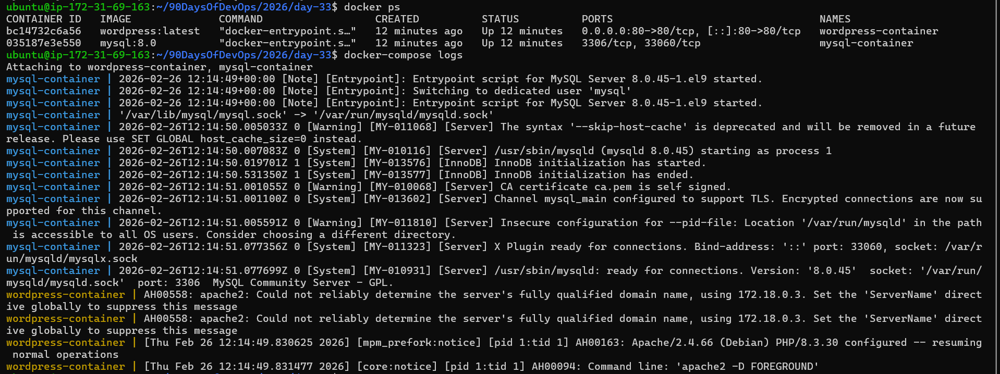

4. View logs of a **specific** service
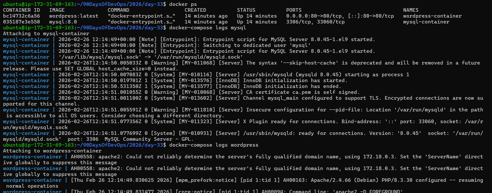

5. **Stop** services without removing
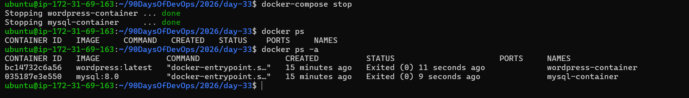

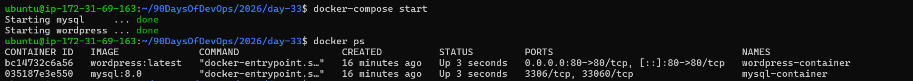

6. **Remove** everything (containers, networks)
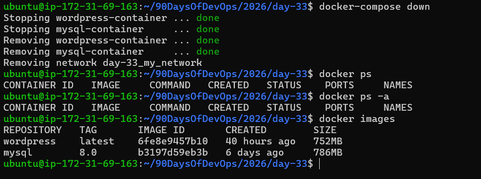

7. **Rebuild** images if you make a change

---

### Task 5: Environment Variables
1. Add environment variables directly in your `docker-compose.yml`
2. Create a `.env` file and reference variables from it in your compose file
3. Verify the variables are being picked up

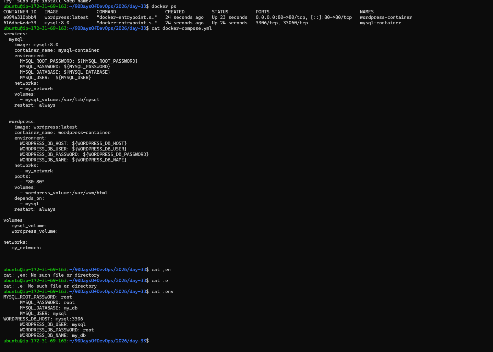

---