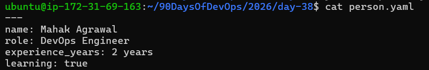
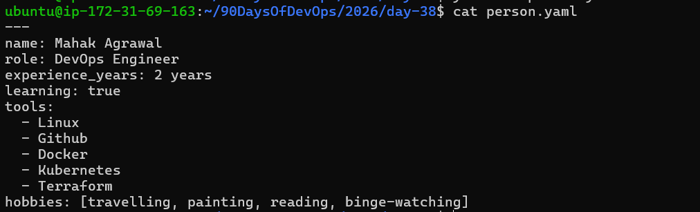
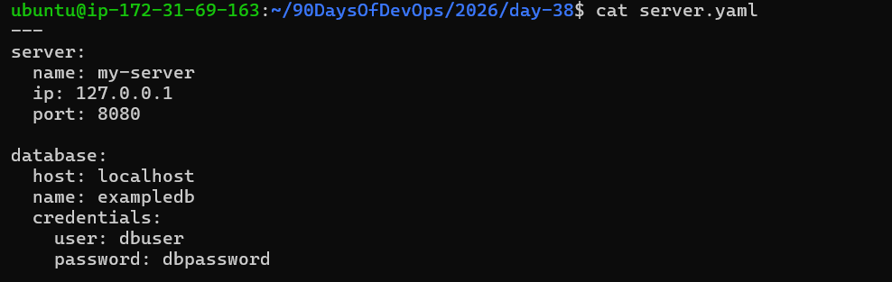
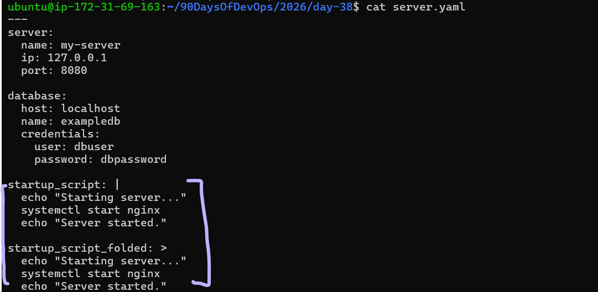

## Challenge Tasks

### Task 1: Key-Value Pairs
Create `person.yaml` that describes yourself with:
- `name`
- `role`
- `experience_years`
- `learning` (a boolean)

**Verify:** Run `cat person.yaml` — does it look clean? No tabs?



---

### Task 2: Lists

Add to `person.yaml`:
- `tools` — a list of 5 DevOps tools you know or are learning
- `hobbies` — a list using the inline format `[item1, item2]`



Write in your notes: What are the two ways to write a list in YAML?

Style:

`UseBlock` (dash) - item1    (Preferred for readability & long lists)

`Inline` (flow) - [item1, item2]   (Short, simple lists)
---

### Task 3: Nested Objects
Create `server.yaml` that describes a server:
- `server` with nested keys: `name`, `ip`, `port`
- `database` with nested keys: `host`, `name`, `credentials` (nested further: `user`, `password`)



**Verify:** Try adding a tab instead of spaces — what happens when you validate it?

What happens if you use a tab?

`yamllint` (linter)

It will report an error similar to:

error    tabs are not allowed  (tabs)

or

error    wrong indentation: expected N but found tab  (indentation)

---

### Task 4: Multi-line Strings
In `server.yaml`, add a `startup_script` field using:
1. The `|` block style (preserves newlines)
2. The `>` fold style (folds into one line)



Write in your notes: When would you use `|` vs `>`?

✅ Use | (Literal Block) when you want to preserve newlines exactly
The | pipe keeps the formatting exactly as written.

Use it when:

1.You are writing shell scripts
2.Multi‑line text
3.Config files
4.Commands where line breaks matter
5.Anything where indentation or newlines should NOT change

✅ Use > (Folded Block) when you want the text folded into one line
The > symbol converts newlines into spaces (except blank lines).

Use it when:

1.Writing long descriptions
2.Paragraphs of text
3.Comments
4.Documentation fields
5.Anything that should become a single flowing line

---

### Task 5: Validate Your YAML
1. Install `yamllint` or use an online validator
2. Validate both your YAML files
3. Intentionally break the indentation — what error do you get?


4. Fix it and validate again


---

### Task 6: Spot the Difference
Read both blocks and write what's wrong with the second one:

```yaml
# Block 1 - correct
name: devops
tools:
  - docker
  - kubernetes
```

✔ Why it’s valid

The list items (docker, kubernetes) are properly indented under tools:.

Each item starts with a dash - at the same level.


```yaml
# Block 2 - broken
name: devops
tools:
- docker
  - kubernetes
```

❌ Why this is invalid

You mixed indentation levels in the list:

- docker has 0 spaces
- kubernetes has 2 spaces

This makes YAML think:

- docker is a list item
- but kubernetes is: 
    either a nested list inside docker (which makes no sense, because docker is a string), or
    incorrectly indented
