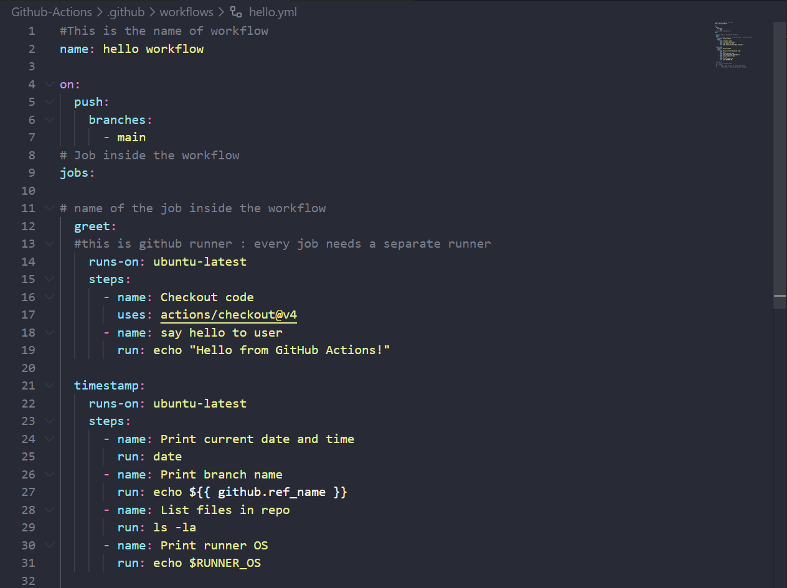
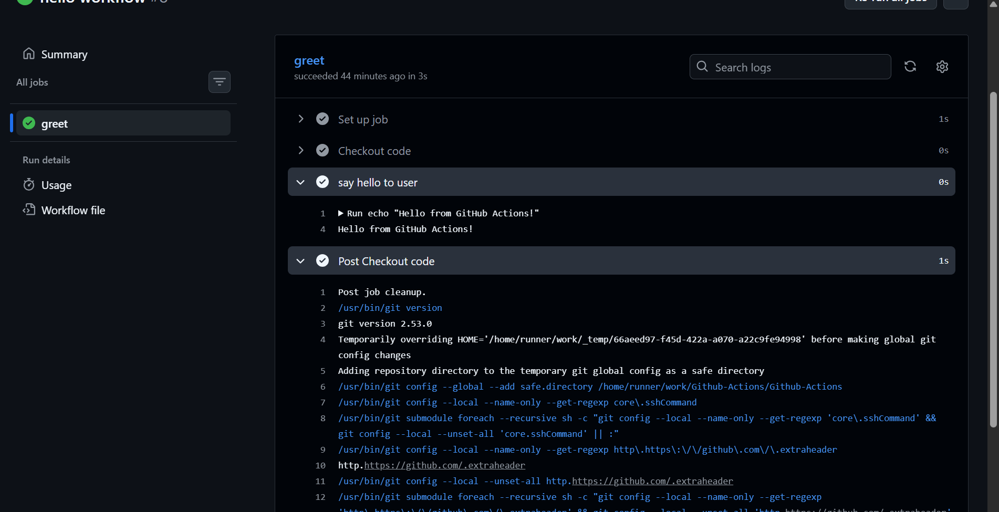
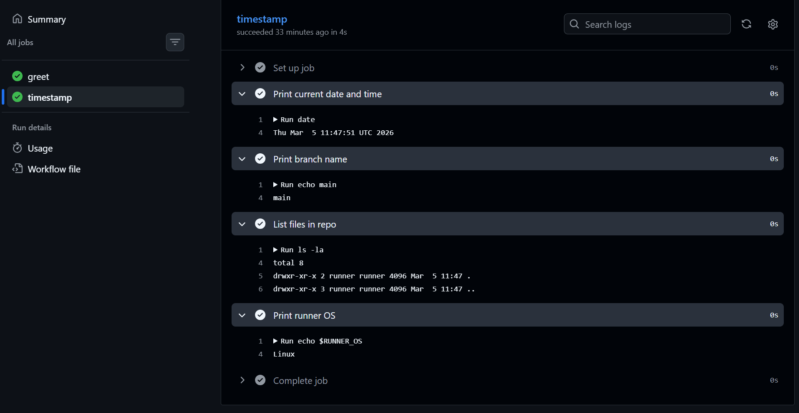
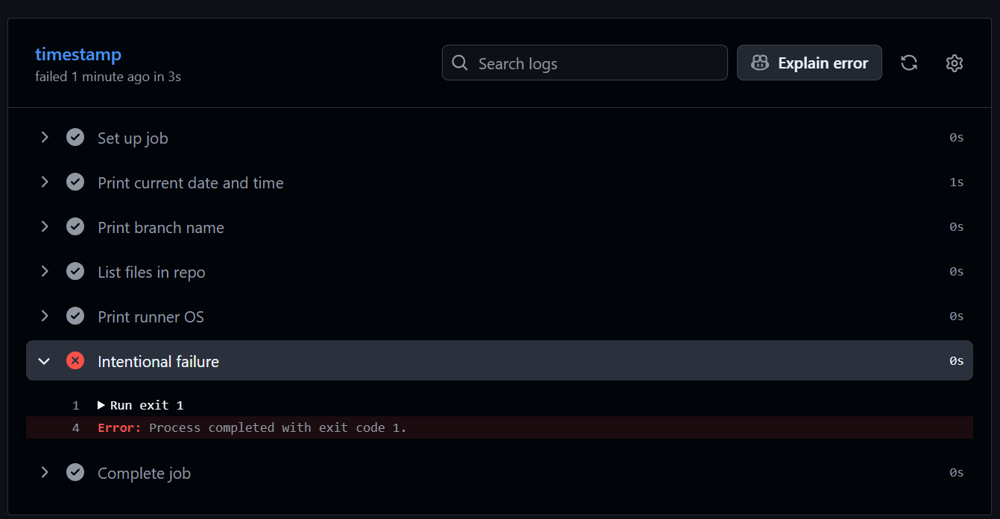

## Challenge Tasks

### Task 1: Set Up
1. Create a new **public** GitHub repository called `github-actions-practice`
2. Clone it locally
3. Create the folder structure: `.github/workflows/`

Repository: [GitHub Actions Practice Repo](https://github.com/mahak933/Github-Actions)

---

### Task 2: Hello Workflow
Create `.github/workflows/hello.yml` with a workflow that:
1. Triggers on every `push`
2. Has one job called `greet`
3. Runs on `ubuntu-latest`
4. Has two steps:
   - Step 1: Check out the code using `actions/checkout`
   - Step 2: Print `Hello from GitHub Actions!`

Push it. Go to the **Actions** tab on GitHub and watch it run.

**Verify:** Is it green? Click into the job and read every step.

After pushing this file, I navigated to the Actions tab on GitHub and watched the workflow run in real-time. The pipeline turned green ✅ on first success.

---

### Task 3: Understand the Anatomy
Look at your workflow file and write in your notes what each key does:

-`on:`

Defines what triggers the workflow.

Examples: push, pull_request, workflow_dispatch, schedule, etc.

- `jobs:`

Contains all the jobs that will run inside the workflow.

Each job runs on its own virtual machine (unless you configure dependencies).

- `runs-on:`

Specifies which machine / runner the job runs on.

Example: ubuntu-latest, windows-latest, macos-latest.

- `steps:`

A job is made up of steps, which run in order inside the same runner.

Steps can run commands, use actions, check out code, install tools, etc.

- `uses:`

Runs an existing GitHub Action (a reusable component).

Example: `uses: actions/checkout@v4`

- `run:`

Executes shell commands directly on the runner.

Example: `run: echo "Hello world"`

- `name:` (on a step)

A human-readable label for a step.

Appears in the Actions UI so logs are easier to read.

Example: `- name: Print environment`

---

### Task 4: Add More Steps
Update `hello.yml` to also:
1. Print the current date and time
2. Print the name of the branch that triggered the run (hint: GitHub provides this as a variable)
3. List the files in the repo
4. Print the runner's operating system

The final hello.yml was updated to include four additional steps:

1. Print current date and time – run: date
2.Print branch name – using the built-in GitHub context variable ${{ github.ref_name }}
3.List files in the repo – run: ls -la
4.Print runner OS – using the environment variable $RUNNER_OS

Each push triggered a new workflow run, visible in the Actions tab with all steps shown.

---

### Task 5: Break It On Purpose
1. Add a step that runs a command that will **fail** (e.g., `exit 1` or a misspelled command)
2. Push and observe what happens in the Actions tab
3. Fix it and push again

Write in your notes: What does a failed pipeline look like? How do you read the error?

What happened:

- The pipeline turned red ❌ in the Actions tab
- The failing step was highlighted in red inside the job view
- All steps after the failing step were skipped automatically
- GitHub showed a clear error: Process completed with exit code 1

How to read a failed pipeline:

1.Go to the Actions tab in your repo
2.Click on the failed run (shown with a red ✗ icon)
3.Click on the job name (e.g., greet)
4.Expand the failed step — it will show the exact command output and error message
5.Fix the issue, push again, and a new run will start

### After the fix:

Removed the exit 1 step and pushed again. The pipeline went back to green ✅.