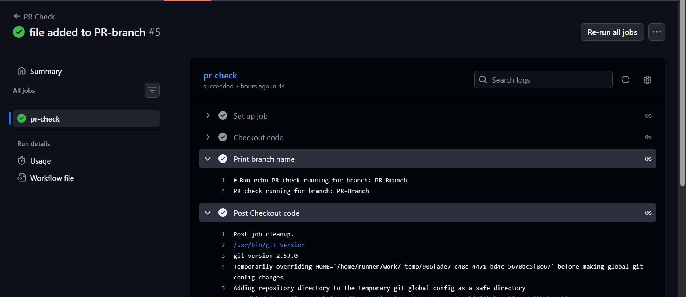
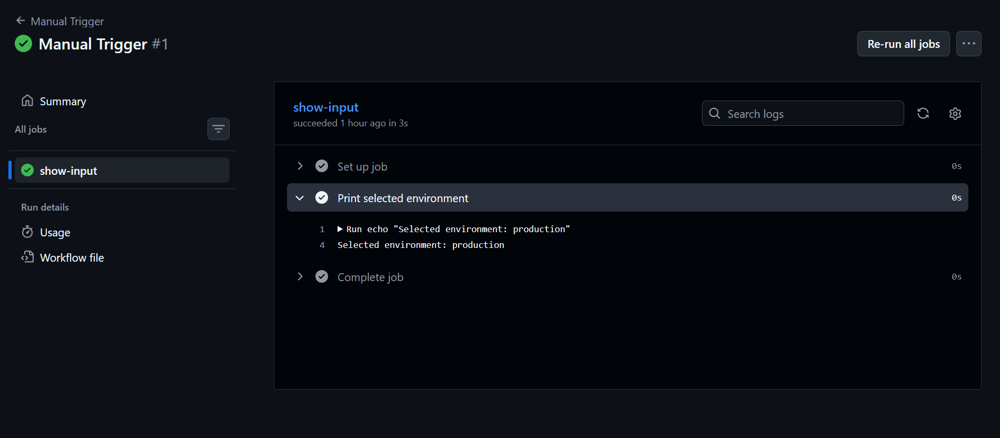
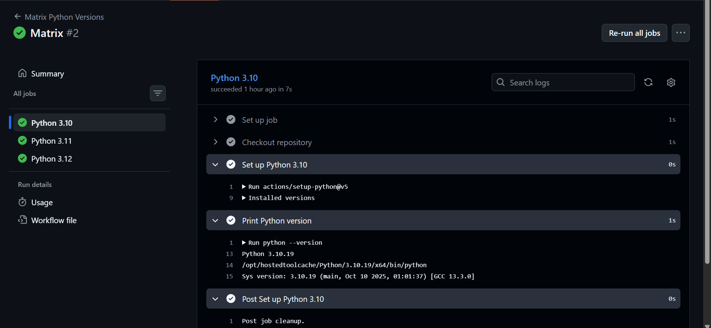
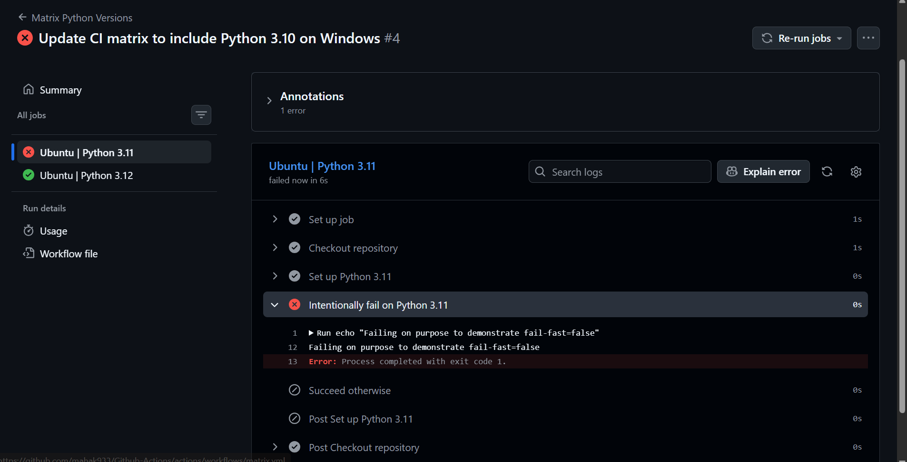

## Challenge Tasks

### Task 1: Trigger on Pull Request
1. Create `.github/workflows/pr-check.yml`
2. Trigger it only when a pull request is **opened or updated** against `main`
3. Add a step that prints: `PR check running for branch: <branch name>`
4. Create a new branch, push a commit, and open a PR
5. Watch the workflow run automatically



```
name: PR Check

on:
  pull_request:
    branches: [ main ]
    types: 
        - opened          #PR just created
        - synchronize     # New commit pushed to PR branch 

jobs:
  pr-check:
    runs-on: ubuntu-latest
    steps:
      - name: Checkout code
        uses: actions/checkout@v4
        
      - name: Print branch name
        run: |
            echo PR check running for branch: ${{ github.head_ref }}
```

**Verify:** Does it show up on the PR page?

✅ Verify it shows up on the PR page

1.Make sure this file is on main first.

For the first time, GitHub only runs PR workflows that exist on the base repo’s default branch.

- If you created the workflow on your feature branch and then opened a PR, it won’t run until the workflow is present on main.
- Quick fix: push this file directly to main (or merge a tiny PR adding it), then open/refresh your PR.


2.Open/refresh the PR targeting main.

You should see the workflow:

- On the PR Checks tab (main place to view logs)
- In the PR conversation timeline (status updates)
- Under Actions → the workflow run list


3.Update (push a commit) to the PR branch to see the synchronize run trigger again.

---


### Task 2: Scheduled Trigger
1. Add a `schedule:` trigger to any workflow using cron syntax
2. Set it to run every day at midnight UTC

```
name: Daily Scheduled Task

on:
  schedule:
    - cron: "0 0 * * *"   # runs every day at 00:00 UTC

jobs:
  daily-job:
    runs-on: ubuntu-latest
    steps:
      - name: Print timestamp
        run: echo "Scheduled workflow running at $(date -u)"
```


3. Write in your notes: What is the cron expression for every Monday at 9 AM?

- Cron expression:

`0 9 * * 1`

Breakdown:

- 0 → minute
- 9 → hour (9 AM)
- * → any day of the month
- * → any month
- 1 → Monday (0 = Sunday, 1 = Monday, ... 6 = Saturday)


---

### Task 3: Manual Trigger
1. Create `.github/workflows/manual.yml` with a `workflow_dispatch:` trigger
2. Add an **input** that asks for an `environment` name (staging/production)
3. Print the input value in a step
4. Go to the **Actions** tab → find the workflow → click **Run workflow**




```
name: Manual Trigger

on:
  workflow_dispatch:
    inputs:
      environment:
        description: "Which environment to use?"
        type: choice
        options:
          - staging
          - production
        default: staging
        required: true

jobs: 
  show-input:
    runs-on: ubuntu-latest
    steps:
      - name: Print selected environment
        run: |
            echo "Selected environment: ${{ github.event.inputs.environment }}"
```


**Verify:** Can you trigger it manually and see your input printed?

If you selected staging:

`Selected environment: staging`

If you selected production:

`Selected environment: production`

---

### Task 4: Matrix Builds
Create `.github/workflows/matrix.yml` that:
1. Uses a matrix strategy to run the same job across:
   - Python versions: `3.10`, `3.11`, `3.12`
2. Each job installs Python and prints the version
3. Watch all 3 run in parallel



```
name: Matrix Python Versions

on:
  push:
  pull_request:

jobs:
  python-matrix:
    name: Python #{{ matrix.python-version }}
    runs-on: ubuntu-latest

    strategy:
      fail-fast: false
      matrix:
        python-version: [ "3.10", "3.11", "3.12" ]

    steps:
      - name: Checkout repository
        uses: actions/checkout@v4

      - name: Set up Python ${{ matrix.python-version }}
        uses: actions/setup-python@v5
        with:
          python-version: ${{ matrix.python-version }}
```


Then extend the matrix to also include 2 operating systems — how many total jobs run now?

`three`
- Pyhton 3.10
- Python 3.11
- Python 3.12

---

### Task 5: Exclude & Fail-Fast
1. In your matrix, **exclude** one specific combination (e.g., Python 3.10 on Windows)
2. Set `fail-fast: false` — trigger a failure in one job and observe what happens to the rest



```
name: Manual Trigger

on:
  workflow_dispatch:
    inputs:
      environment:
        description: "Which environment to use?"
        type: choice
        options:
          - staging
          - production
        default: staging
        required: true

jobs: 
  show-input:
    runs-on: ubuntu-latest
    steps:
      - name: Print selected environment
        run: |
            echo "Selected environment: ${{ github.event.inputs.environment }}"
```

3. Write in your notes: What does `fail-fast: true` (the default) do vs `false`?

✅ fail-fast: true (default behavior)

- If any one job in the matrix fails, GitHub Actions will cancel all the other running or queued jobs in the matrix.
- Purpose: Save time and resources when a failure means the rest of the jobs don’t matter.

Example:
If Python 3.11 fails, then Python 3.10 and 3.12 jobs are cancelled automatically.

🔄 fail-fast: false

- If one job fails, the other matrix jobs continue running normally.
- Nothing gets cancelled.
- Useful when you want full results, even if one version/platform fails.

Example:
If Python 3.11 fails, Python 3.10 and 3.12 jobs still finish and show success/failure independently.

---
