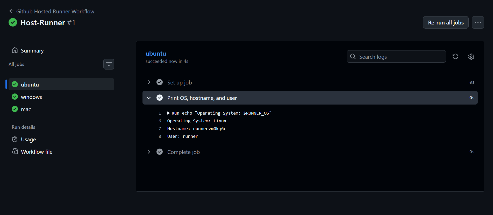
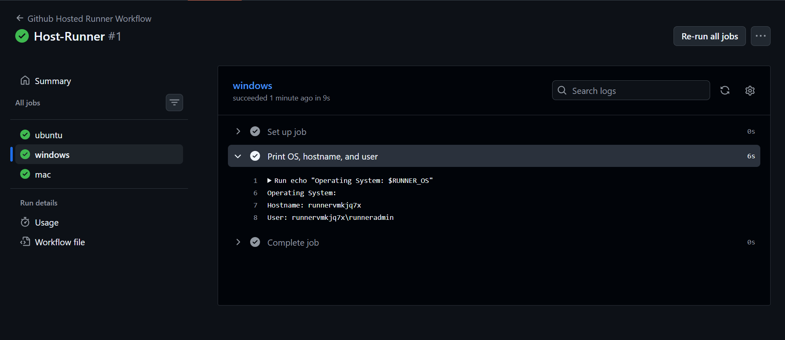
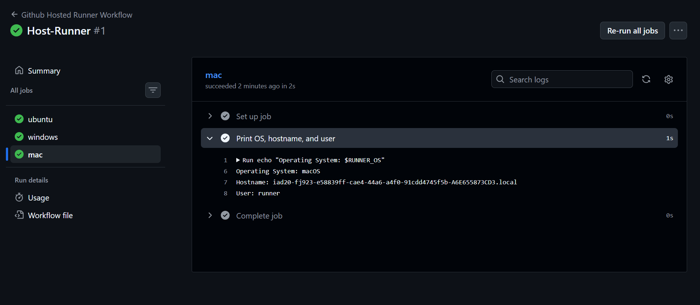
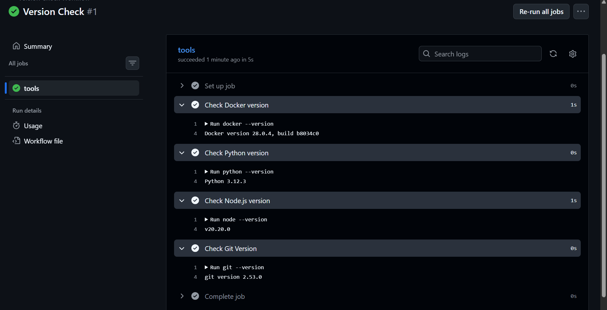
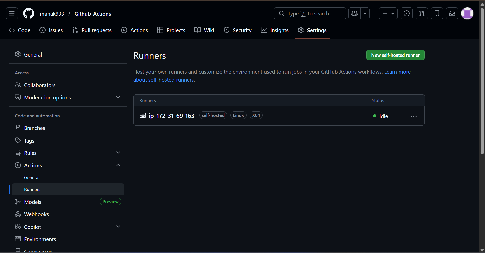
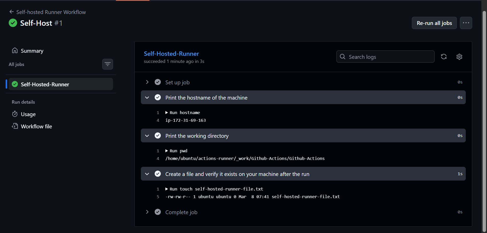

## Challenge Tasks

### Task 1: GitHub-Hosted Runners
1. Create a workflow with 3 jobs, each on a different OS:
   - `ubuntu-latest`



   - `windows-latest`



   - `macos-latest`



2. In each job, print:
   - The OS name
   - The runner's hostname
   - The current user running the job
3. Watch all 3 run in parallel

Write in your notes: What is a GitHub-hosted runner? Who manages it?

- A `GitHub‑hosted runner` is a short‑lived virtual machine (or VM-like environment) that GitHub provisions on demand to execute your workflow jobs.
- It comes preinstalled with common tools and languages and is ephemeral—it’s created for the job, runs your steps, then is destroyed.
- `Who manages it?` GitHub (backed by Microsoft/Azure infrastructure) manages provisioning, scaling, OS images, updates, and security hardening—so you don’t need to maintain any build agents yourself.

`Key properties`

1. Images: ubuntu-latest, windows-latest, macos-latest (plus specific version pins).
2. Auto-scales for public repos; concurrency limits apply to private/org repos depending on plan.
3. Clean environment each run → reproducible builds.

---

### Task 2: Explore What's Pre-installed
1. On the `ubuntu-latest` runner, run a step that prints:
   - Docker version
   - Python version
   - Node version
   - Git version
2. Look up the GitHub docs for the full list of pre-installed software on `ubuntu-latest`

Write in your notes: Why does it matter that runners come with tools pre-installed?

`GitHub-hosted runners` matter because they give you fast, reliable, secure, ready-to-use build machines with a full suite of preinstalled development tools — maintained and updated by GitHub — so your workflows are faster, simpler, and more stable.



---

### Task 3: Set Up a Self-Hosted Runner
Runner registered via Settings → Actions → Runners → New self-hosted runner, following the Linux setup instructions.

**Verify:** Your runner appears in the Runners list with a green dot.

Setup flow:

```
mkdir actions-runner && cd actions-runner
curl -o actions-runner-linux-x64.tar.gz -L https://github.com/actions/runner/releases/download/...
tar xzf ./actions-runner-linux-x64.tar.gz
./config.sh --url https://github.com/<user>/<repo> --token <TOKEN>
./run.sh
```

To run as a persistent service:

```
sudo ./svc.sh install
sudo ./svc.sh start
```



---

### Task 4: Use Your Self-Hosted Runner
1. Create `.github/workflows/self-hosted.yml`
2. Set `runs-on: self-hosted`
3. Add steps that:
   - Print the hostname of the machine (it should be YOUR machine/VM)
   - Print the working directory
   - Create a file and verify it exists on your machine after the run
4. Trigger it and watch it run on your own hardware

```
name: self-hosted
on:
  push:
    branches: [main]

jobs:
  self-hosted:
    runs-on: [self-hosted, my-linux-runner]
    steps:
      - name: prints the hostname of the VM
        run: echo $HOSTNAME
      - name: prints the working directory
        run: pwd
      - name: creating a file
        run: touch file1.txt
      - name: verifying if the file exists
        run: cat file1.txt

```        
Verified: file1.txt was created on the local machine after the run completed.



---

### Task 5: Labels
Label my-linux-runner was added to the self-hosted runner in GitHub settings. The workflow targets it with:

```
runs-on: [self-hosted, my-linux-runner]
```

Why labels matter: When you have multiple self-hosted runners (e.g., one GPU machine, one ARM machine, one staging server), labels let you route specific jobs to the right hardware. Without labels, any available self-hosted runner picks up the job — labels give you precision.

---

### Task 6: GitHub-Hosted vs Self-Hosted
Fill this in your notes:

| | GitHub-Hosted | Self-Hosted |
|---|---|---|
| Who manages it? | GitHub (fully managed) | You (your machine or VM) |
| Cost | Free for public repos and limited minutes for private repos; paid plans for more minutes | Depends on your infra — can be free (local machine) or cost of servers/VMs |
| Pre-installed tools | Many built‑in tools: Node.js, Python, Java, .NET, Docker, etc. (updated automatically) | None by default — you install and maintain everything |
| Good for | Quick setup, CI pipelines, standard builds, teams who don’t want infra overhead | Long builds, custom environments, large workloads, secret‑heavy workflows, on‑prem needs |
| Security concern | Shared hardware (multi‑tenant), internet‑exposed, limited control over environment | You must secure the machine yourself; risk if misconfigured or unpatched |

---