## Challenge Tasks

### Task 1: GitHub Secrets
1. Go to your repo → Settings → Secrets and Variables → Actions
2. Create a secret called `MY_SECRET_MESSAGE`
3. Create a workflow that reads it and prints: `The secret is set: true` (never print the actual value)

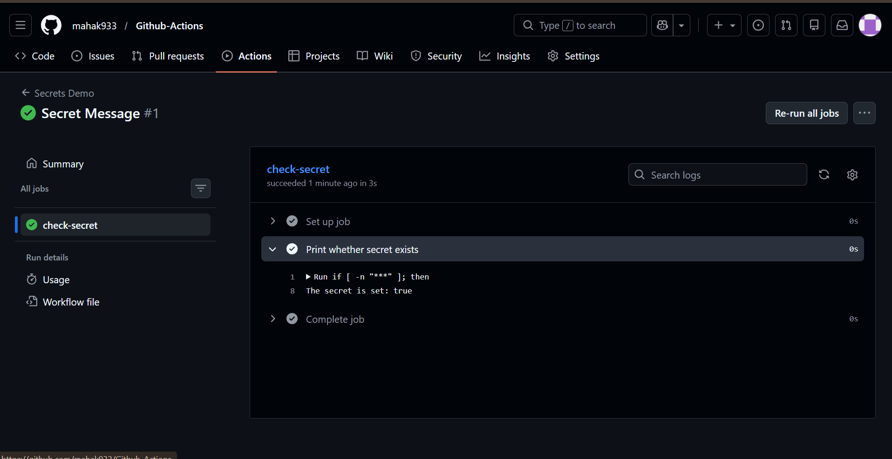

4. Try to print `${{ secrets.MY_SECRET_MESSAGE }}` directly — what does GitHub show?

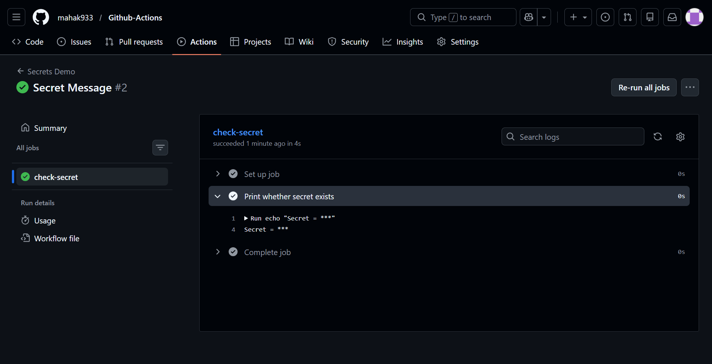

Write in your notes: Why should you never print secrets in CI logs?

- CI logs can be viewed by many people and may be stored for a long time.
- Anyone who sees the logs could steal the secret and misuse it.
- Logs often get exported or shared, increasing exposure.
- Even private repos aren’t fully safe—other collaborators or compromised accounts can access logs.
- Once a secret is leaked, it must be rotated immediately.

---

### Task 2: Use Secrets as Environment Variables
1. Pass a secret to a step as an environment variable

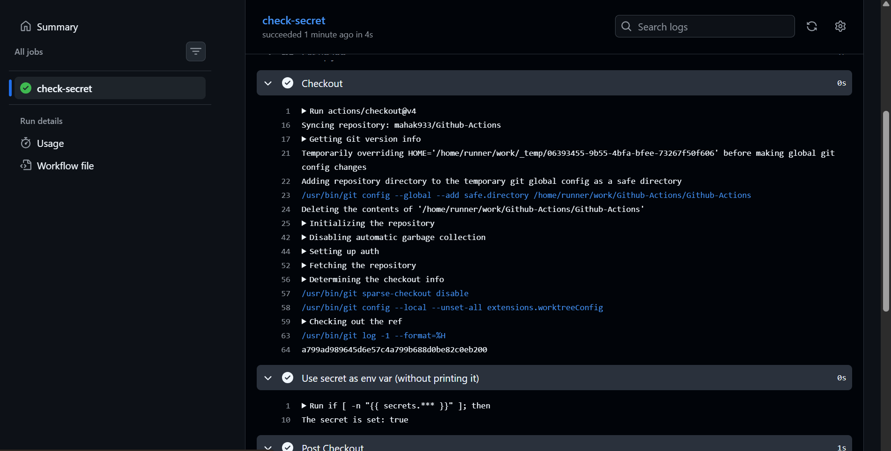

2. Use it in a shell command without ever hardcoding it

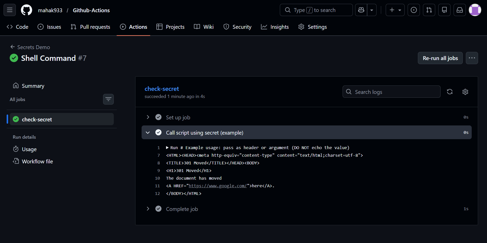

3. Add `DOCKER_USERNAME` and `DOCKER_TOKEN` as secrets (you'll need these on Day 45)

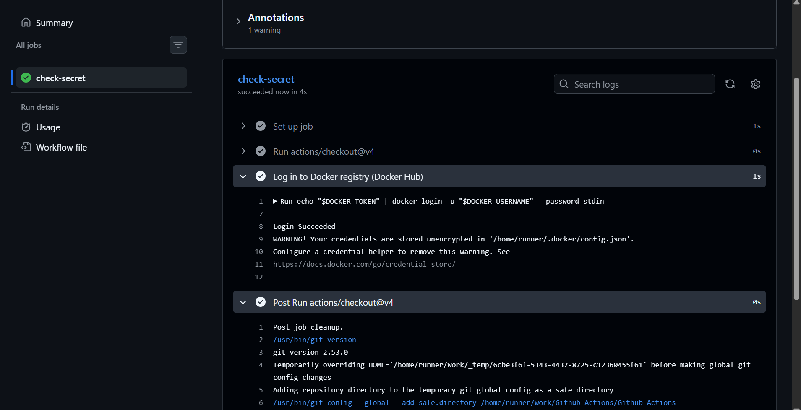

---

### Task 3: Upload Artifacts
1. Create a step that generates a file — e.g., a test report or a log file
2. Use `actions/upload-artifact` to save it

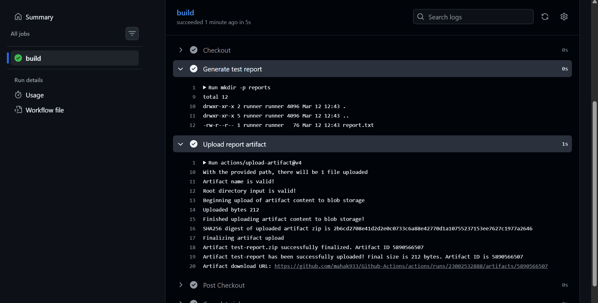

3. After the workflow runs, download the artifact from the Actions tab

.png)

**Verify:** Can you see and download it from GitHub?
Verify: Yes, I am able to see and download the artifact from GitHub.

---

### Task 4: Download Artifacts Between Jobs
1. Job 1: generate a file and upload it as an artifact

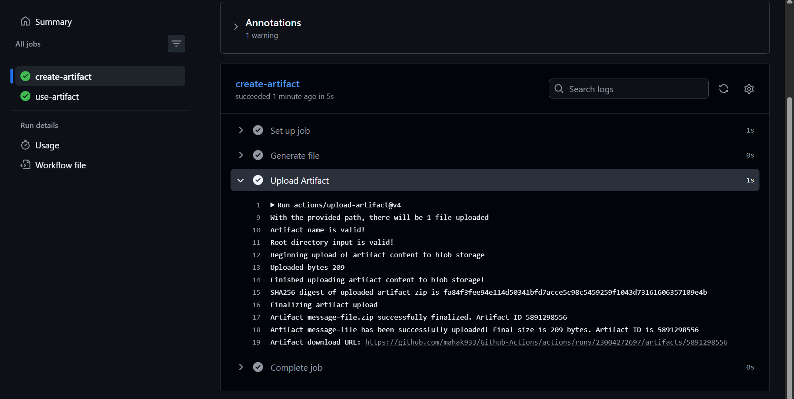

2. Job 2: download the artifact from Job 1 and use it (print its contents)

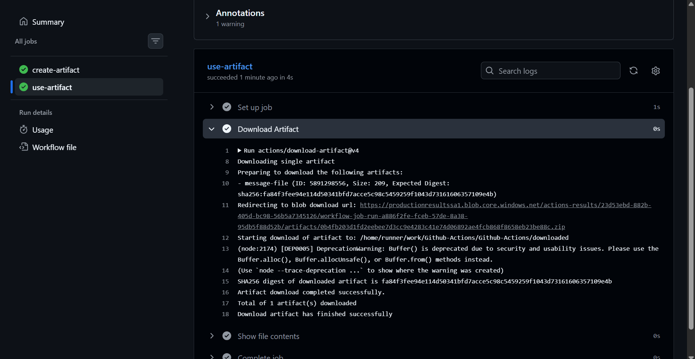

Write in your notes: When would you use artifacts in a real pipeline?

- To pass files between jobs when jobs run on different machines.
- To store test reports, coverage reports, or lint outputs for review.
- To save build outputs like binaries, packages, or compiled assets.
- To collect logs or screenshots for debugging failed tests.
- To share temporary files when jobs run in parallel but need to share results.

---

### Task 5: Run Real Tests in CI
Take any script from your earlier days (Python or Shell) and run it in CI:
1. Add your script to the `github-actions-practice` repo
2. Write a workflow that:
   - Checks out the code
   - Installs any dependencies needed
   - Runs the script
   - Fails the pipeline if the script exits with a non-zero code
3. Intentionally break the script — verify the pipeline goes red

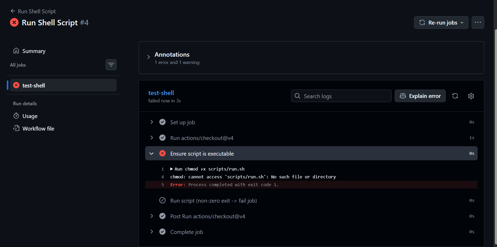

4. Fix it — verify it goes green again

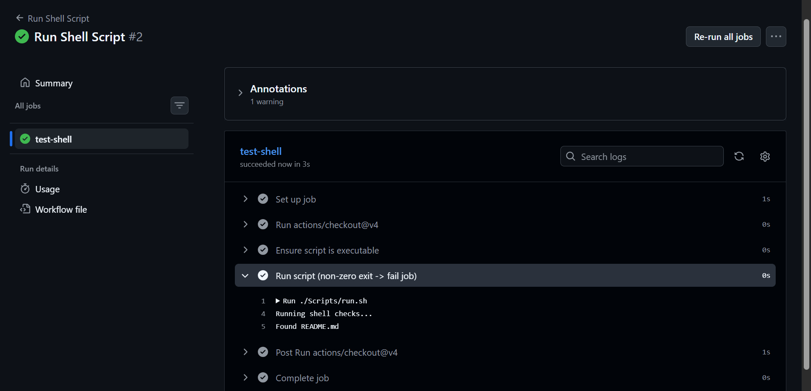

---

### Task 6: Caching
1. Add `actions/cache` to a workflow that installs dependencies

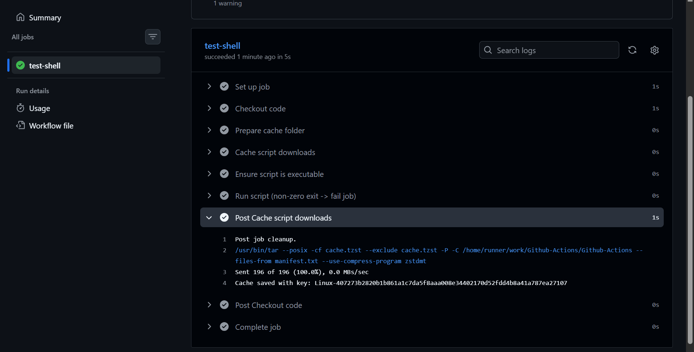

2. Run it twice — observe the time difference

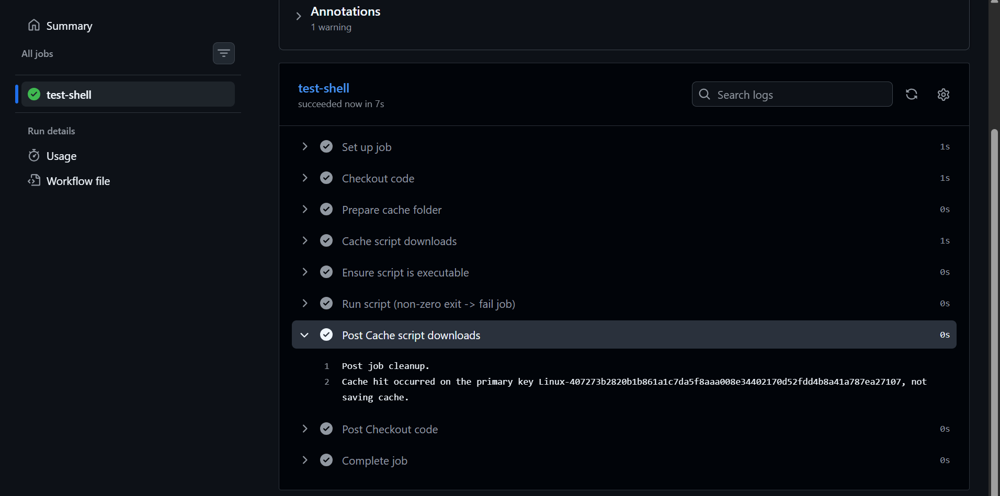

3. Write in your notes: What is being cached and where is it stored?

What is being cached?

You are caching:

- apt package downloads
- apt metadata
- any general dependency cache folder (~/.cache)
- Anything your shell script downloads and stores locally

Where is it stored?

GitHub stores the cache in:

- GitHub’s global cache storage
- Scoped to your repository
- Identified by the cache key you provided

Caches are automatically restored when the same key appears again.

---