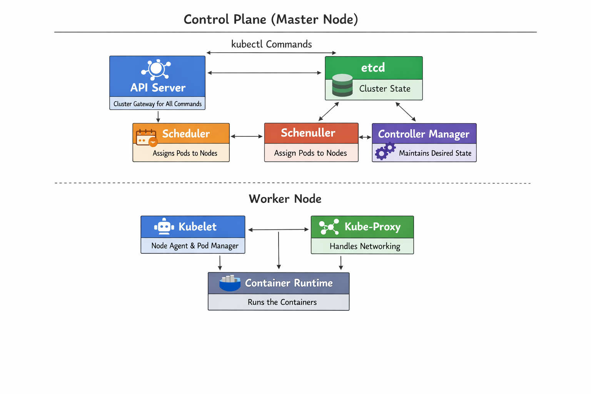
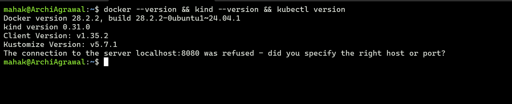
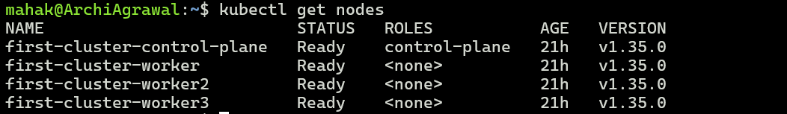
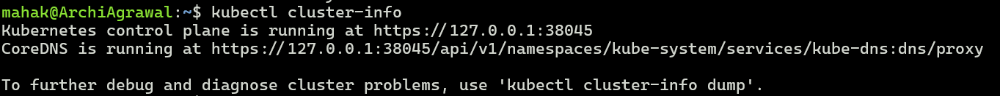
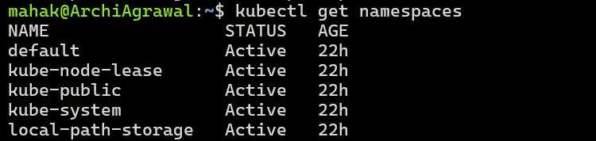
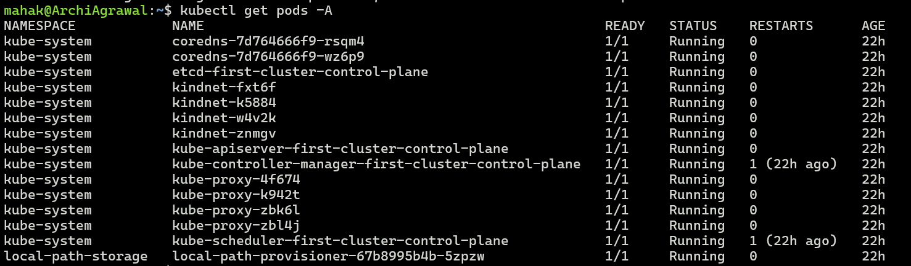
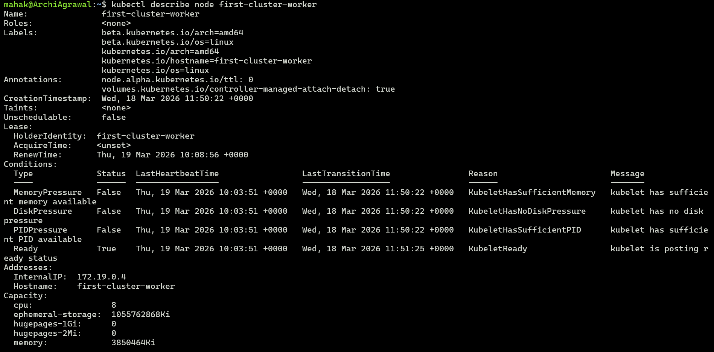
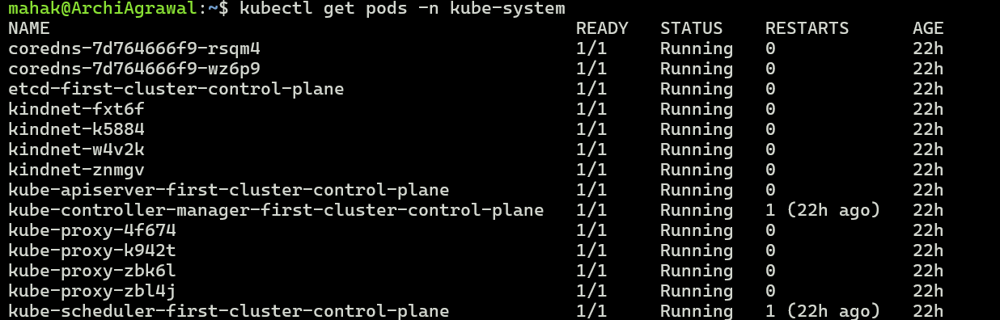

## Challenge Tasks

### Task 1: Recall the Kubernetes Story

1. Why was Kubernetes created? What problem does it solve that Docker alone cannot?

Docker solved the problem of packaging applications into containers, but it didn’t handle running those containers at scale. Kubernetes was created to manage:
- `Orchestration`: scheduling containers across many machines.
- `Scaling`: automatically adjusting workloads based on demand.
- `Resilience`: restarting failed containers and maintaining desired state.
- `Networking & service discovery`: making distributed containers communicate reliably.
So Kubernetes addresses the operational challenges of containerized applications that Docker alone cannot.


2. Who created Kubernetes and what was it inspired by?

- Kubernetes was created by `Google engineers`.
- It was inspired by Google’s internal cluster management systems, `Borg` and later `Omega`, which had been used for years to run massive workloads in Google’s data centers.
- Kubernetes is essentially an open-source reimagining of those ideas for the wider community.

3. What does the name "Kubernetes" mean?

- The name comes from Greek, meaning helmsman or pilot — the person who steers a ship.
- The nautical theme is reflected in its logo (a ship’s wheel).
- Symbolically, Kubernetes “steers” containers in production environments.


---

### Task 2: Draw the Kubernetes Architecture



After drawing, verify your understanding:
- What happens when you run `kubectl apply -f pod.yaml`? Trace the request through each component.

1. `kubectl` sends the pod definition to the **API Server**
2. **API Server** stores the desired state in **etcd**
3. **Controller Manager** detects the new pod and triggers scheduling
4. **Scheduler** selects an appropriate worker node
5. **API Server** notifies the **kubelet** on that node
6. **kubelet** uses the **Container Runtime** to start the container
7. **kube-proxy** updates networking so the pod is reachable

- What happens if the API server goes down?

1. No new requests or changes can be processed  
2. Existing workloads continue running  
3. Cluster state cannot be updated until API server is restored

- What happens if a worker node goes down?

1. **kubelet** stops reporting to the API server  
2. **Controller Manager** notices pods are missing  
3. Kubernetes reschedules pods to healthy nodes (if available)  
4. **kube-proxy** updates networking to route traffic to new pods


---

### Task 3: Install kubectl



---

### Task 4: Set Up Your Local Cluster

I went with kind (Kubernetes in Docker). The main reason: it works inside WSL without needing a separate VM. Minikube may need a hypervisor driver depending on your setup, and that adds friction. With kind, as long as Docker is running, you're good.

I used a config.yml to create a multi-node cluster instead of the default single-node — one control plane and three workers. More realistic setup for actually practising scheduling and node behaviour.

# config.yml used to create the cluster

```
kind: Cluster
apiVersion: kind.x-k8s.io/v1alpha4
nodes:
  - role: control-plane
  - role: worker
  - role: worker
  - role: worker
```  

---

### Task 5: Explore Your Cluster

Local cluster (WSL)

`kind create cluster --config config.yml --name demo-cluster`


# List all nodes
`kubectl get nodes`



# See cluster info
`kubectl cluster-info`




# List all namespaces
`kubectl get namespaces`




# See ALL pods running in the cluster (across all namespaces)
`kubectl get pods -A`



# Get detailed info about your node
`kubectl describe node <node-name>`



Look at the pods running in the `kube-system` namespace:

`kubectl get pods -n kube-system`





| Pod Name                    | What It Does                                                                 |
|----------------------------|------------------------------------------------------------------------------|
| kube-apiserver-*           | The API server — every request goes through this                             |
| etcd-*                     | Cluster database — stores all state                                          |
| kube-scheduler-*           | Decides which node a pod runs on                                             |
| kube-controller-manager-*  | Watches cluster state, runs reconciliation loops                             |
| coredns-* (2 pods)         | DNS inside the cluster — pods use this to find each other by service name    |
| kube-proxy-* (one per node)| Networking rules on each node                                                |
| kindnet-* (one per node)   | kind's CNI — handles pod-to-pod networking across nodes                      |


---

### Task 6: Practice Cluster Lifecycle

Write down: What is a kubeconfig? Where is it stored on your machine?

kubeconfig is the file kubectl uses to know which cluster to talk to and who you are. It stores cluster addresses, credentials (certificates), and contexts.

Default location: ~/.kube/config

```
kubectl config current-context   # shows which cluster you're connected to
kubectl config get-contexts      # lists all available clusters/contexts
kubectl config view              # shows the full file (with secrets omitted)
```

A context ties together three things: a cluster, a user, and a namespace. When I ran set-context --current --namespace=nginx-ns, I modified the existing context to point at nginx-ns by default — I didn't create a new context.


### Key Commands from Today

```

# Cluster info
kubectl cluster-info
kubectl get nodes
kubectl get nodes -o wide

# Explore all running pods across the cluster
kubectl get pods -A

# kube-system specifically
kubectl get pods -n kube-system

# Namespace operations
kubectl get ns
kubectl apply -f namespace.yml
kubectl config set-context --current --namespace=<name>

# kubeconfig
kubectl config current-context
kubectl config get-contexts
kubectl config view

# Cluster lifecycle
kind create cluster --config config.yml --name demo-cluster
kind delete cluster --name demo-cluster
Kind get clusters

```