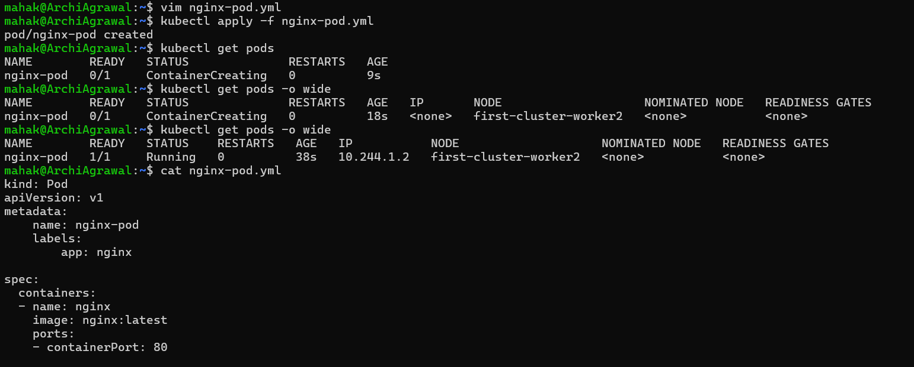
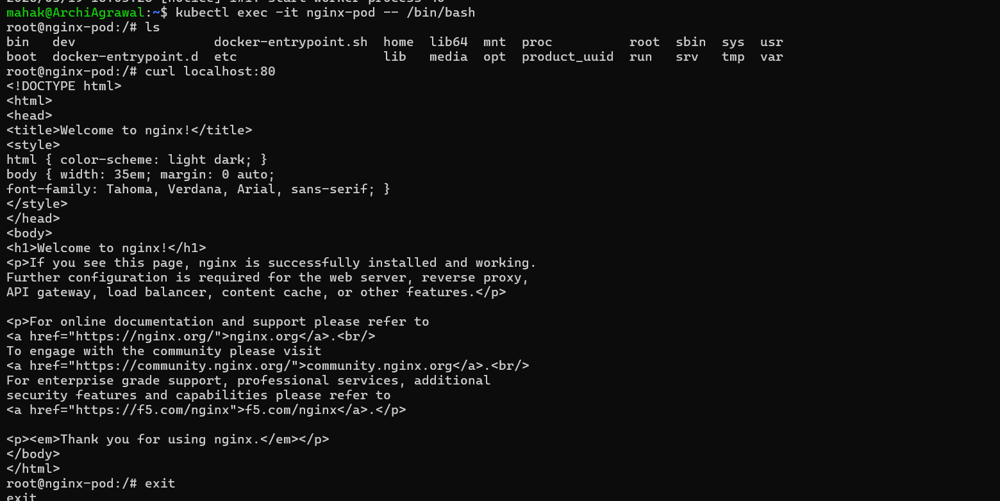
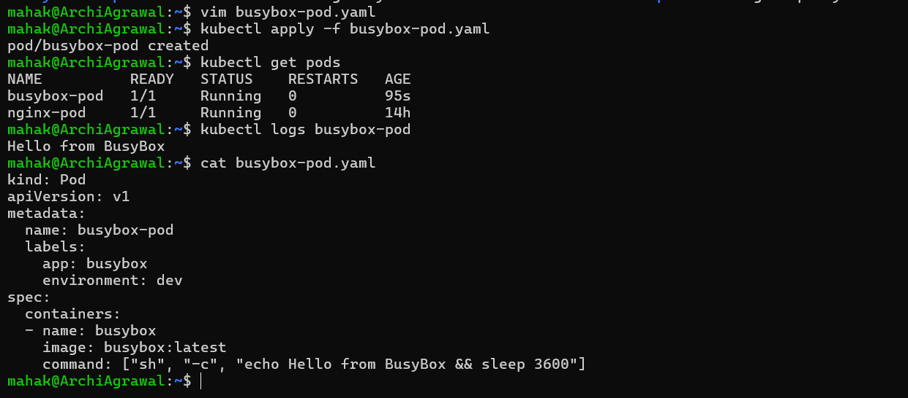
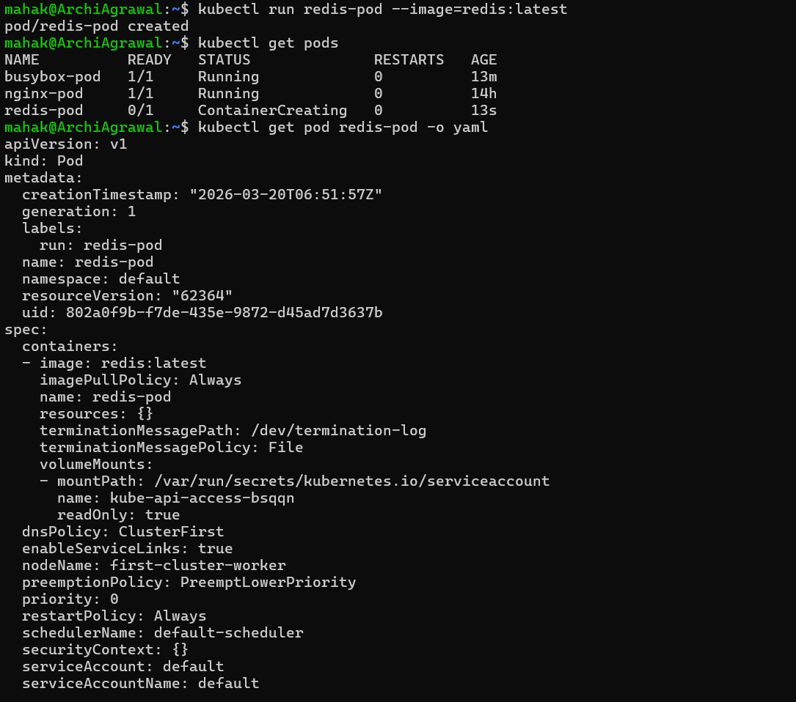
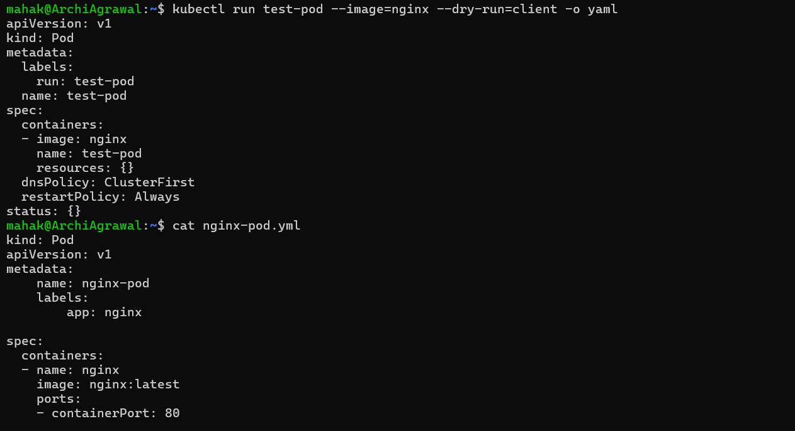
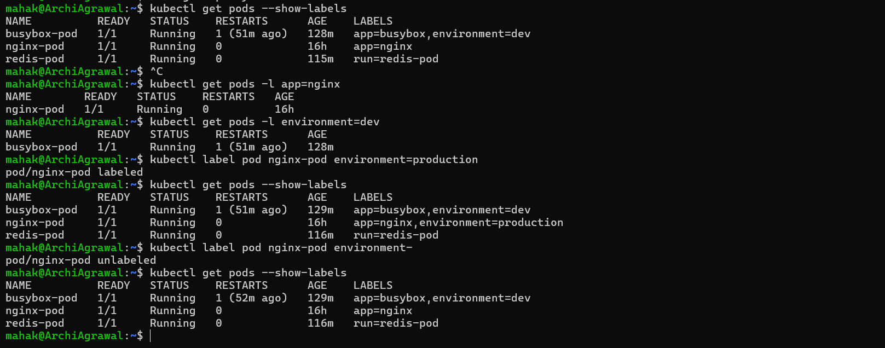
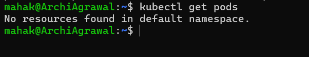

## Challenge Tasks

### Task 1: Create Your First Pod (Nginx)
Create a file called `nginx-pod.yaml`:

**Verify:** Can you see the Nginx welcome page when you curl from inside the pod?

`Yes`, Ngnix welcome page is visible inside the pod container.

---

### Task 2: Create a Custom Pod (BusyBox)

**Verify:** Can you see "Hello from BusyBox" in the logs?

`Yes`

---

### Task 3: Imperative vs Declarative
You have been using the declarative approach (writing YAML, then `kubectl apply`). Kubernetes also supports imperative commands:

**Verify:** Save the dry-run output to a file and compare its structure with your nginx-pod.yaml. What fields are the same? What is different?

✅ Fields That Are the Same

1. Kind: Both are `Pod`
2. apiVersion: Both are `v1`
3. metadata → name:
- Dry-run: `test-pod`
- Your file: `nginx-pod`
(different values, but same field structure)
4. metadata → labels:
- Dry-run: `run: test-pod`
- Your file: app: `nginx`
(same concept, different key/value)
5. spec → containers → name:
- Dry-run: `test-pod`
- Your file: `nginx`
6. spec → containers → image:
- Dry-run: `nginx`
- Your file: `nginx:latest`
(same field, slightly different image tag)

❌ Fields That Are Different

1. Dry-run output includes extra defaults:
- `resources:{}` → empty resource requests/limits
- `dnsPolicy`: ClusterFirst
- `restartPolicy`: Always
- `status:{}` → empty status block
2. Your nginx-pod.yaml includes:
- `ports:` → explicitly exposes `containerPort: 80`
- No `resources`, `dnsPolicy`, `restartPolicy`, or `status` defined (these are optional and defaulted by Kubernetes)

---

### Task 4: Validate Before Applying

**Verify:** What error does Kubernetes give when the image field is missing?

### Task 5: Pod Labels and Filtering
Labels are how Kubernetes organizes and selects resources. You added labels in your manifests — now use them:

---

### Task 6: Clean Up
Delete all the pods you created:

