## Challenge Tasks

### Task 1: Explore Default Namespaces
Kubernetes comes with built-in namespaces. List them:

```bash
kubectl get namespaces
```

Check what is running inside `kube-system`:
```bash
kubectl get pods -n kube-system
```

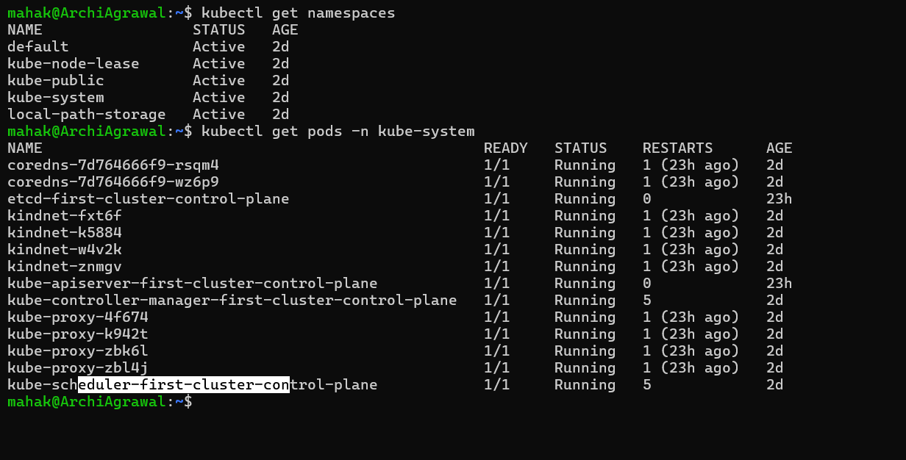

**Verify:** How many pods are running in `kube-system`?


### Task 2: Create and Use Custom Namespaces
Create two namespaces — one for a development environment and one for staging:

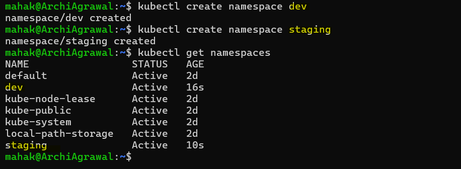


Now run a pod in a specific namespace:

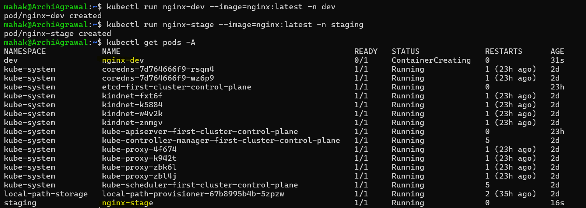


**Verify:** Does `kubectl get pods` show these pods? What about `kubectl get pods -A`?

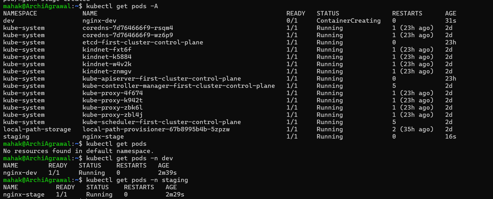


### Task 3: Create Your First Deployment

Create a file `nginx-deployment.yaml`:

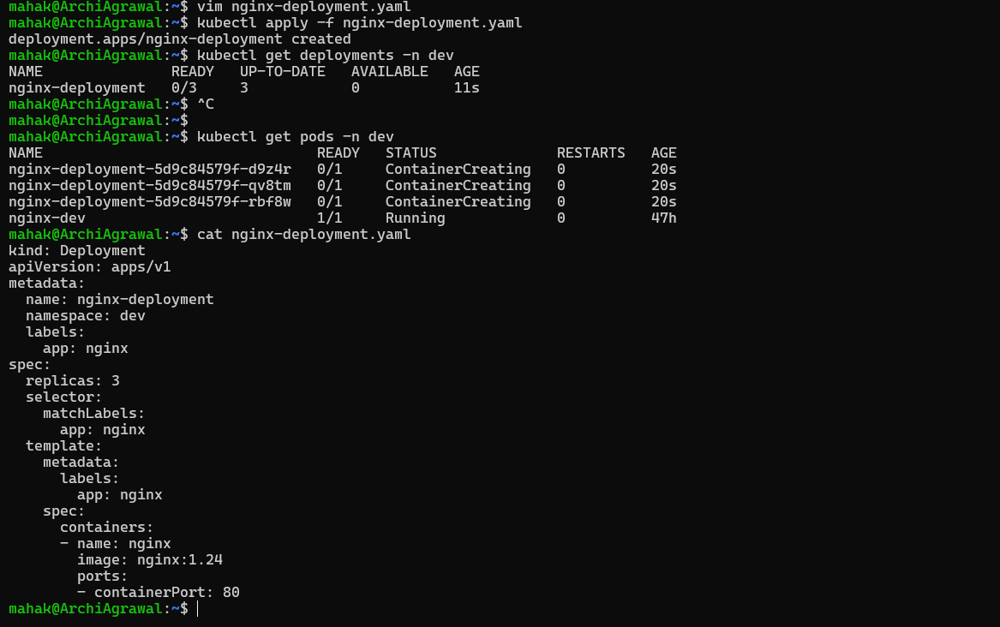

You should see 3 pods with names like `nginx-deployment-xxxxx-yyyyy`.

**Verify:** What do the READY, UP-TO-DATE, and AVAILABLE columns mean in the deployment output?

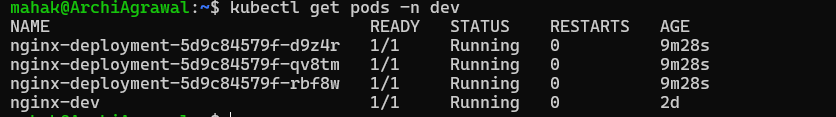

- READY → Shows how many pods are currently in a Ready state versus the desired number of replicas.

- UP-TO-DATE → Indicates how many pods have been updated to match the latest deployment specification.

- AVAILABLE → Displays how many pods are available to serve user requests. A pod is considered available if it’s running and has passed readiness checks.

My follow-up pod listing, all three replicas are now in `Running` state with `READY 1/1`, so the deployment should soon show `READY 3/3`, `UP-TO-DATE 3`, and `AVAILABLE 3`.

---

### Task 4: Self-Healing — Delete a Pod and Watch It Come Back

The Deployment controller detects that only 2 of 3 desired replicas exist and immediately creates a new one. The deleted pod is replaced within seconds.

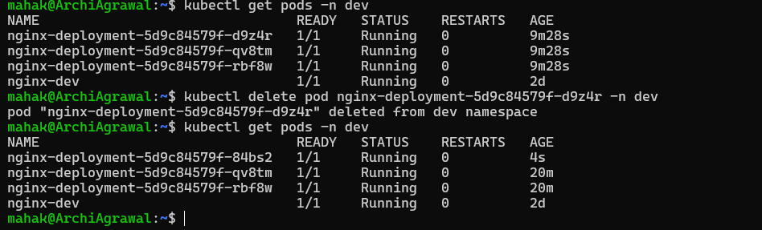

**Verify:** Is the replacement pod's name the same as the one you deleted, or different?

The replacement pod's name is different from delelted pod.

---

### Task 5: Scale the Deployment
Change the number of replicas:

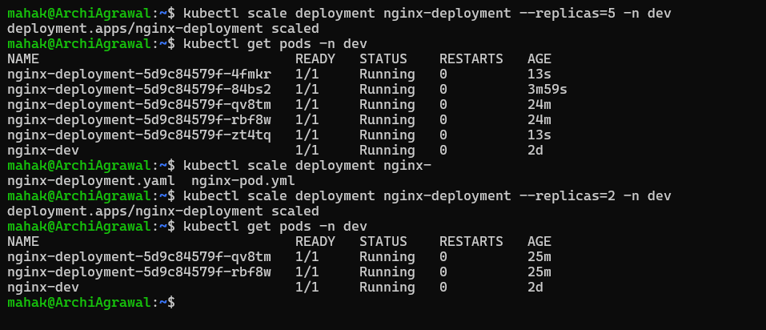

**Verify:** When you scaled down from 5 to 2, what happened to the extra pods?

- ReplicaSet adjustment → The Deployment’s ReplicaSet was updated to reflect the new desired count (replicas: 2).
- Pod termination → Three of the five running pods were selected for deletion. Kubernetes chooses which pods to remove based on internal logic (generally oldest pods first, but it can vary depending on scheduling and availability).
- Graceful shutdown → Each terminated pod went through its shutdown lifecycle:
- Sent a SIGTERM signal to containers.
- Allowed a grace period (default 30s) for the containers to stop cleanly.
- Finally removed the pod objects from the cluster.
- Remaining pods → Two pods continued running, satisfying the new desired state.
So in short: the “extra” pods didn’t linger—they were gracefully terminated by Kubernetes to bring the deployment back in line with the requested replica count.

### Task 6: Rolling Update
Update the Nginx image version to trigger a rolling update:

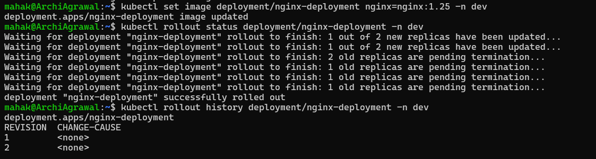


**Verify:** What image version is running after the rollback?

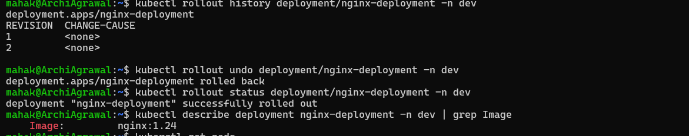

Ans: Nginx:1.24

---

### Task 7: Clean Up

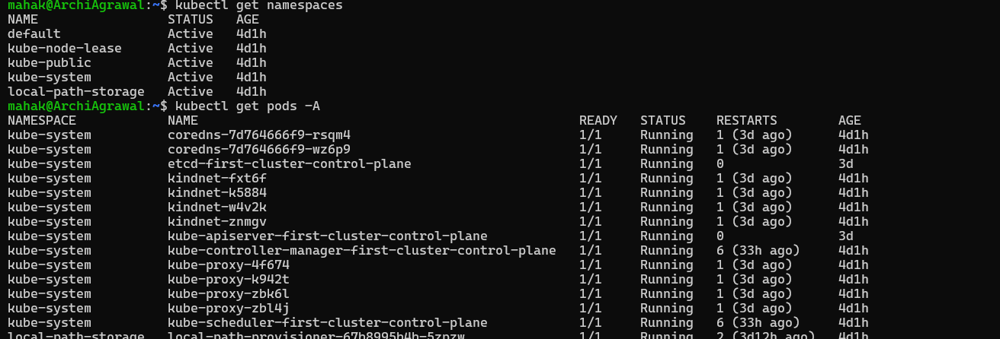

**Verify:** Are all your resources gone?

`YES`

---

### Key Commands

```
# Namespaces
kubectl get namespaces
kubectl apply -f namespace.yml
kubectl create ns production

# Pods across namespaces
kubectl get pods -n dev-ns
kubectl get pods -A

# Deployment
kubectl apply -f nginx-deployment.yml
kubectl get deployments -n nginx-ns
kubectl describe deployment nginx-app -n nginx-ns

# Scaling
kubectl scale deployment nginx-app --replicas=5 -n nginx-ns

# Rolling update
kubectl set image deployment/nginx-app nginx-container=nginx:1.25 -n nginx-ns
kubectl rollout status deployment/nginx-app -n nginx-ns
kubectl rollout history deployment/nginx-app -n nginx-ns
kubectl rollout undo deployment/nginx-app -n nginx-ns

# Check image after rollback
kubectl describe deployment nginx-app -n nginx-ns | grep Image

# Cleanup
kubectl delete deployment nginx-app -n nginx-ns
kubectl delete namespace dev-ns staging-ns
kubectl get all -A

```
