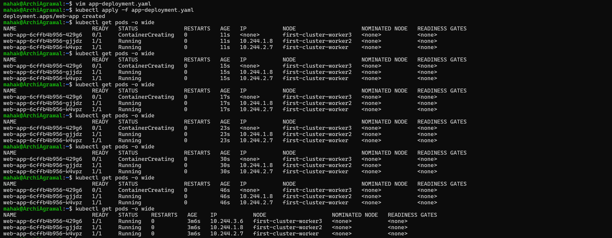
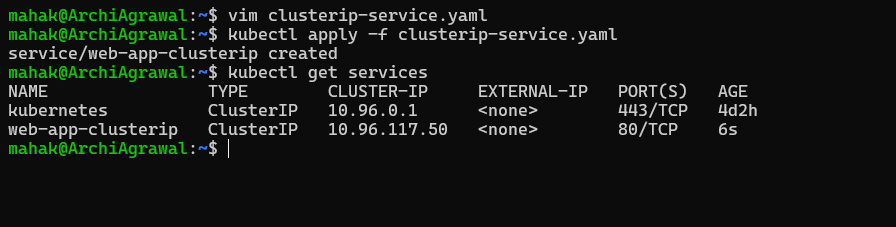
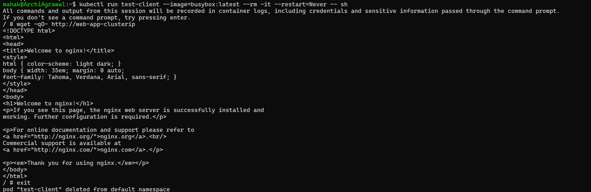
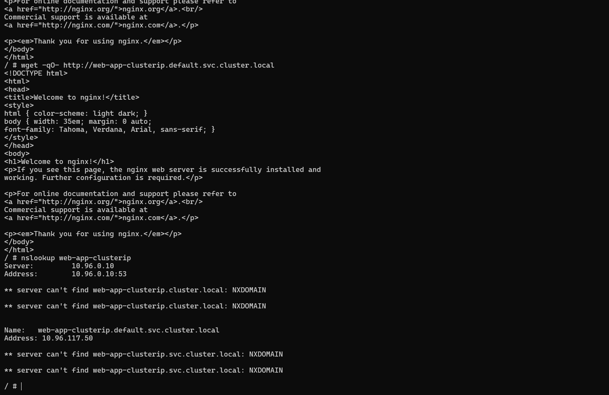
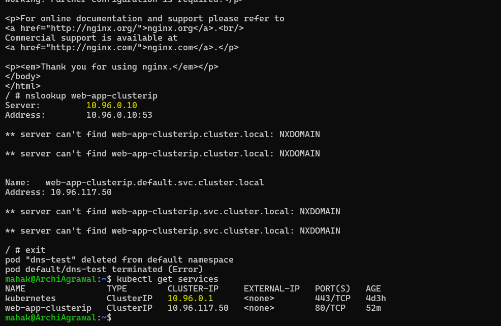
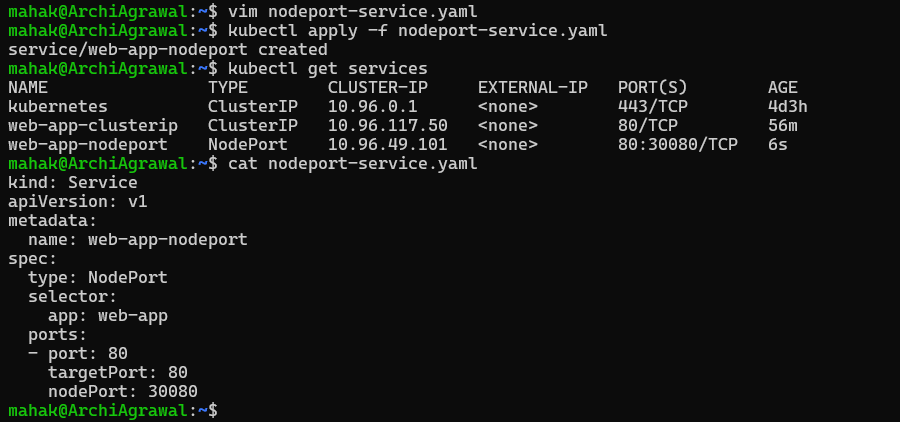
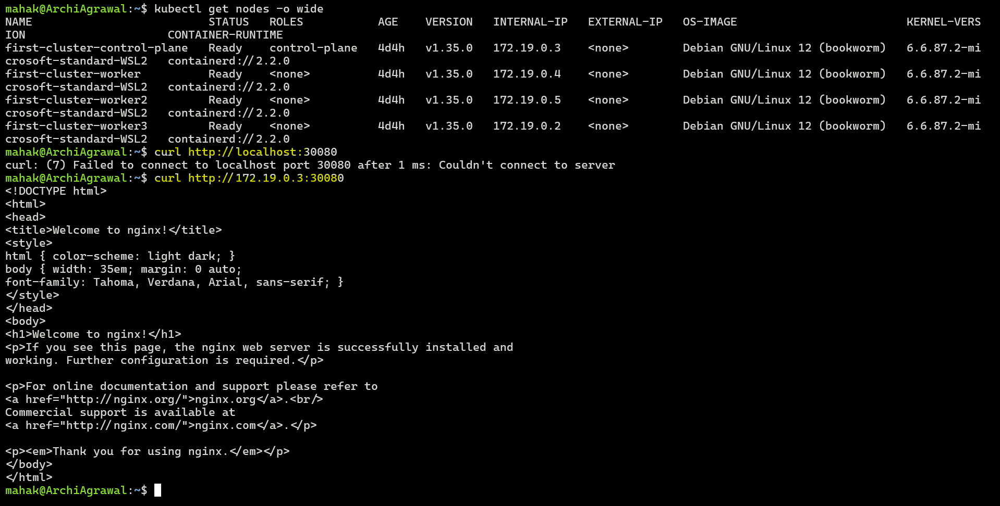
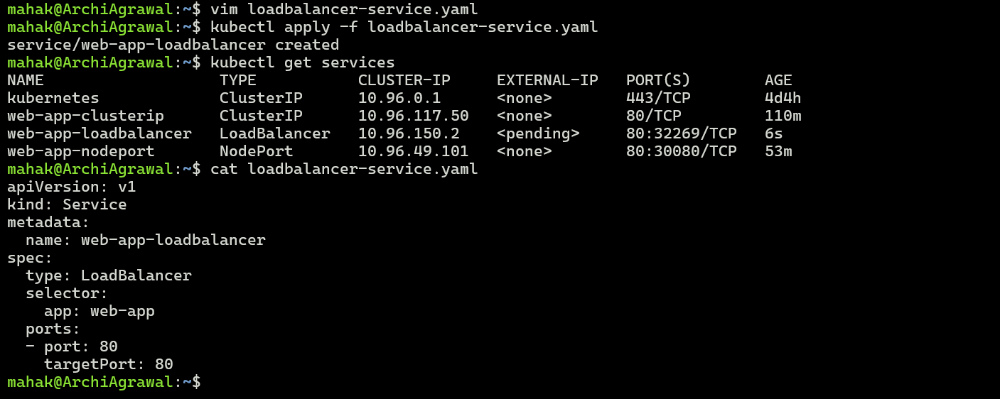
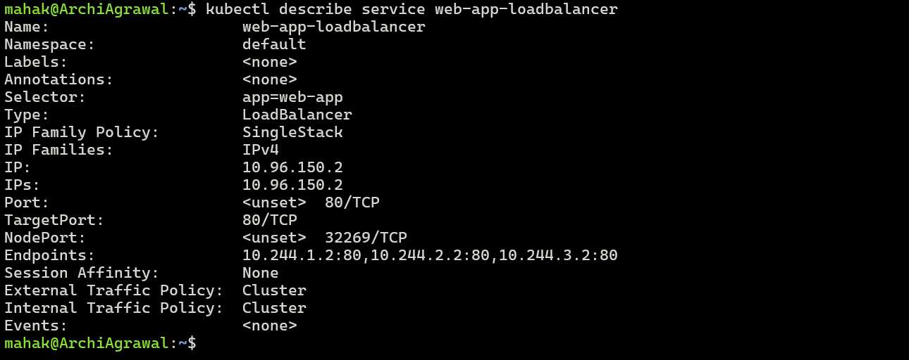
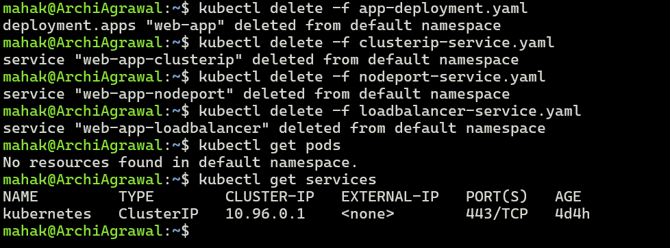

## Challenge Tasks

### Task 1: Deploy the Application
First, create a Deployment that you will expose with Services. Create `app-deployment.yaml`:




Note the individual Pod IPs. These will change if pods restart — that is the problem Services fix.

🔑 Services solve this problem:
- A Service provides a stable virtual IP (ClusterIP) and DNS name that doesn’t change, even if the underlying pods do.
- It uses label selectors to automatically route traffic to the right pods.
- As pods come and go, the Service updates its endpoints list, ensuring clients always reach the current healthy pods without needing to know their individual IPs.


**Verify:** Are all 3 pods running? Note down their IP addresses.

IP 
10.244.3.6      
10.244.1.8   
10.244.2.7

---

### Task 2: ClusterIP Service (Internal Access)
ClusterIP is the default Service type. It gives your Pods a stable internal IP that is only reachable from within the cluster.

Create `clusterip-service.yaml`:



You should see `web-app-clusterip` with a CLUSTER-IP address. This IP is stable — it will not change even if Pods restart.


You should see the Nginx welcome page. The Service load-balanced your request to one of the 3 Pods.



**Verify:** Does the Service respond? Try running the wget command multiple times — the Service distributes traffic across all healthy Pods.


---
### Task 3: Discover Services with DNS

Test this:
```bash
kubectl run dns-test --image=busybox:latest --rm -it --restart=Never -- sh
```




**Verify:** What IP does `nslookup` return? Does it match the CLUSTER-IP from `kubectl get services`?

`Yes`



---

### Task 4: NodePort Service (External Access via Node)
A NodePort Service exposes your application on a port on every node in the cluster. This lets you access the Service from outside the cluster.

Create `nodeport-service.yaml`:



Access the service:




**Verify:** Can you see the Nginx welcome page from your browser or terminal using the NodePort?

`Yes`

---

### Task 5: LoadBalancer Service (Cloud External Access)

Create `loadbalancer-service.yaml`:



**Verify:** What does the EXTERNAL-IP column show? Why is it `<pending>` on a local cluster?

🌐 Why EXTERNAL-IP shows <pending> in Kind
- LoadBalancer services rely on a cloud provider’s load balancer (like AWS ELB, Azure LB, GCP LB).
- In a local cluster (Kind, Minikube, Docker Desktop), there is no cloud provider integration.
- Because of that, Kubernetes cannot provision a real external load balancer, so the EXTERNAL-IP field stays <pending> forever.
✅ What this means for you
- The web-app-loadbalancer service won’t get a usable external IP in Kind.
- Instead, you should use:
- The NodePort service (web-app-nodeport) → accessible via <node-ip>:30080.
- Or kubectl port-forward to map the service to localhost.

---

### Task 6: Understand the Service Types Side by Side
Check all three services:



You should see all three: a ClusterIP, a NodePort, and the LoadBalancer configuration.

**Verify:** Does the LoadBalancer service also have a ClusterIP and NodePort assigned?

Yes — a LoadBalancer service in Kubernetes always includes a ClusterIP and a NodePort underneath. That’s because each type builds on the previous one:
- ClusterIP: the internal service address inside the cluster.
- NodePort: automatically allocated when you create a LoadBalancer, so the service can be reached via <NodeIP>:<NodePort>.
- LoadBalancer: adds an external load balancer (from a cloud provider) that forwards traffic to the NodePort

---

### Task 7: Clean Up

Only the built-in `kubernetes` service in the default namespace should remain.



**Verify:** Is everything cleaned up?

`Yes` Everthing is cleaned up

---

