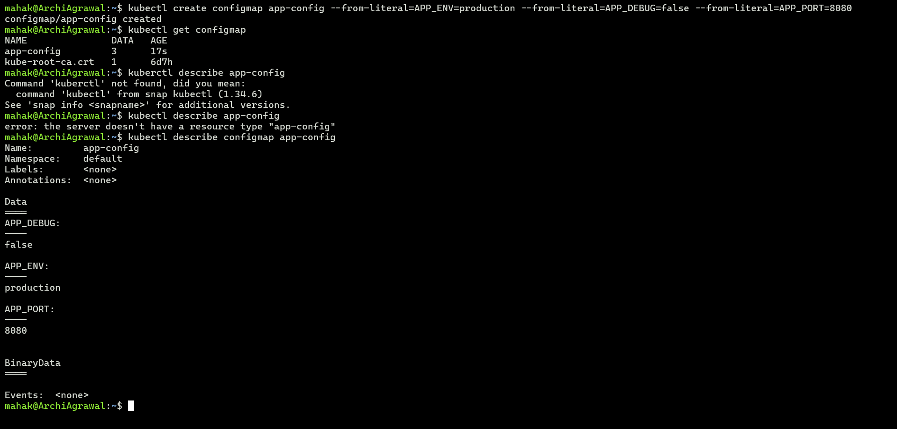
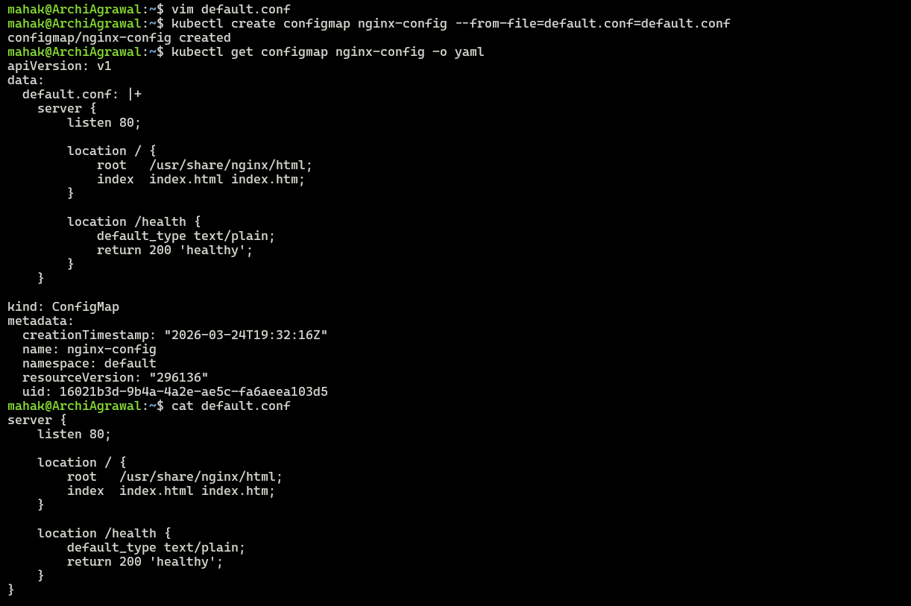
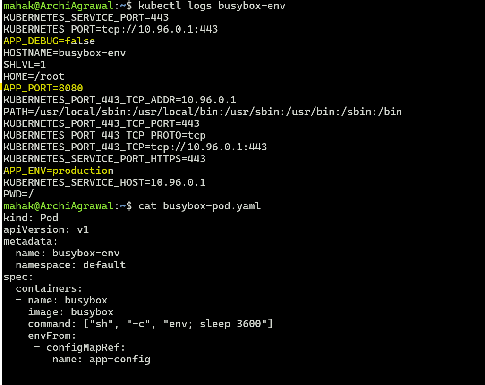
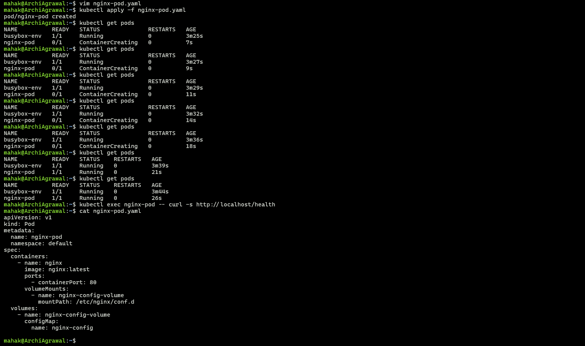
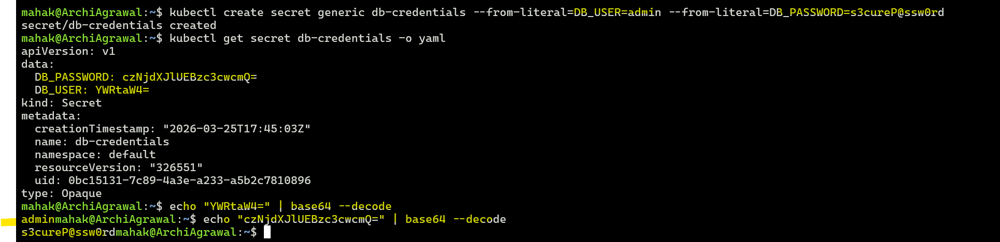
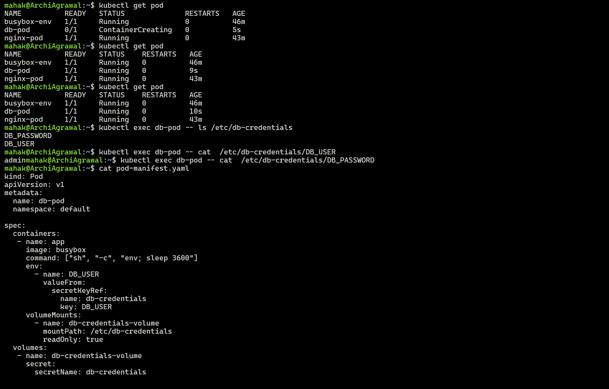

## Challenge Tasks

### Task 1: Create a ConfigMap from Literals

- Notice the data is stored as plain text — no encoding, no encryption

Yes — all three key-value pairs are visible as plain text in the data section. ConfigMaps don’t encrypt or encode values; they’re stored exactly as you provide them.
✅ Verification: You should clearly see APP_ENV=production, APP_DEBUG=false, and APP_PORT=8080.

**Verify:** Can you see all three key-value pairs?

`Yes`

---

### Task 2: Create a ConfigMap from a File

- The key name (`default.conf`) becomes the filename when mounted into a Pod

**Verify:** Does `kubectl get configmap nginx-config -o yaml` show the file contents?

✅ Verification: Yes — the file contents appear inline under the data section, with default.conf as the key. That confirms the ConfigMap was created correctly from your file.
Would you like me to also show you how to mount this ConfigMap into an Nginx pod so that it actually uses your custom default.conf? That way you can test the /health endpoint live.

---

### Task 3: Use ConfigMaps in a Pod
1. Write a Pod manifest that uses `envFrom` with `configMapRef` to inject all keys from `app-config` as environment variables. Use a busybox container that prints the values.

2. Write a second Pod manifest that mounts `nginx-config` as a volume at `/etc/nginx/conf.d`. Use the nginx image.
3. Test that the mounted config works: `kubectl exec <pod> -- curl -s http://localhost/health`

Use environment variables for simple key-value settings. Use volume mounts for full config files.

**Verify:** Does the `/health` endpoint respond?

✅ Verification:
- The BusyBox pod shows all three environment variables from app-config.
- The Nginx pod responds with "healthy" at /health, confirming the mounted config works.

---

### Task 4: Create a Secret

**base64 is encoding, not encryption.** Anyone with cluster access can decode Secrets. The real advantages are RBAC separation, tmpfs storage on nodes, and optional encryption at rest.

**Verify:** Can you decode the password back to plaintext?

✅ Verification: Yes, you can decode the password back to plaintext. This demonstrates that Kubernetes Secrets use base64 encoding for transport/storage convenience, not encryption.

⚡ Key Insight
- Encoding ≠ Encryption → Anyone with cluster access can decode Secrets.
- Real advantages of Secrets:
- RBAC separation (only authorized Pods/users can access them).
- Stored in tmpfs on nodes (not written to disk).
- Optional encryption at rest (if enabled in cluster settings).

---

### Task 5: Use Secrets in a Pod

**Verify:** Are the mounted file values plaintext or base64?

✅ Answer to your verification question: The mounted file values are stored as plaintext, not base64. Kubernetes decodes them before presenting them to the container.

---

### Task 6: Update a ConfigMap and Observe Propagation
1. Create a ConfigMap `live-config` with a key `message=hello`
2. Write a Pod that mounts this ConfigMap as a volume and reads the file in a loop every 5 seconds
3. Update the ConfigMap: `kubectl patch configmap live-config --type merge -p '{"data":{"message":"world"}}'`
4. Wait 30-60 seconds — the volume-mounted value updates automatically
5. Environment variables from earlier tasks do NOT update — they are set at pod startup only

**Verify:** Did the volume-mounted value change without a pod restart?

---

### Task 7: Clean Up
Delete all pods, ConfigMaps, and Secrets you created.

---