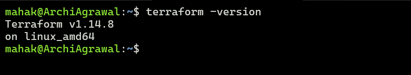
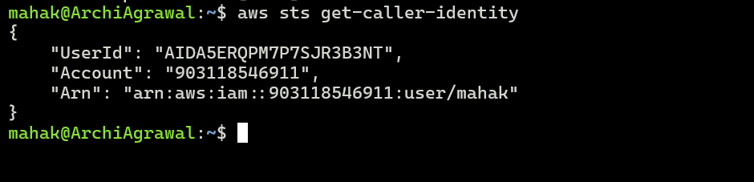
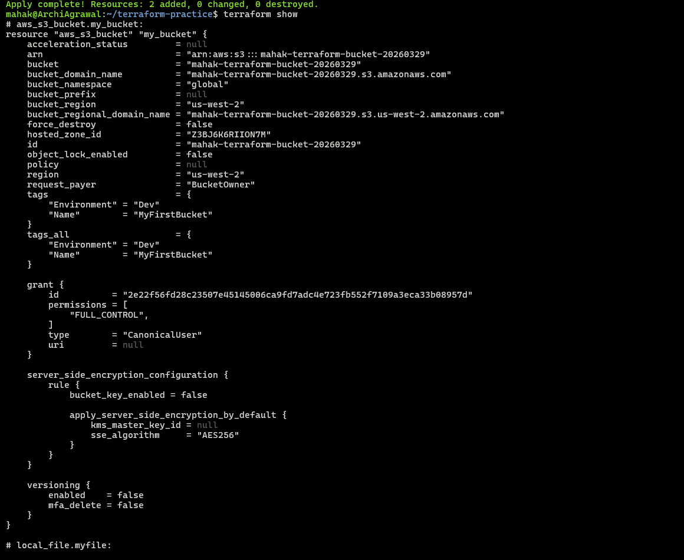
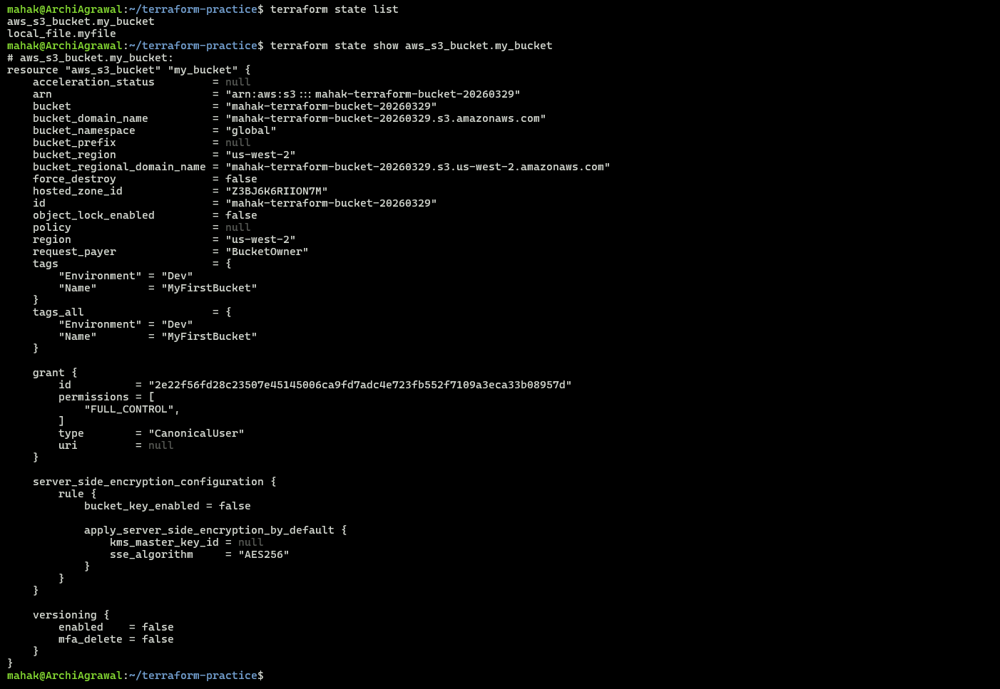
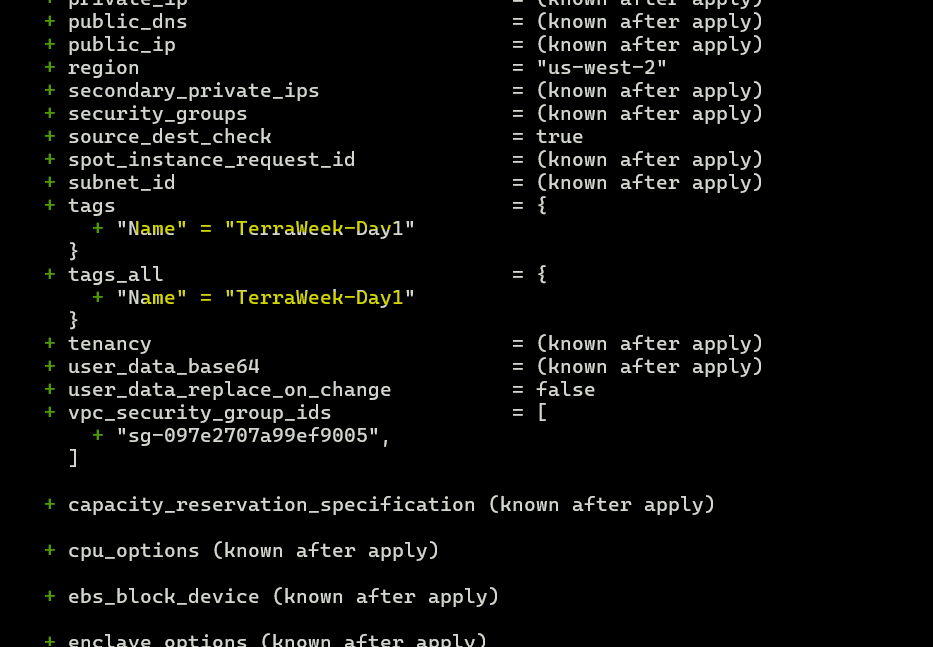
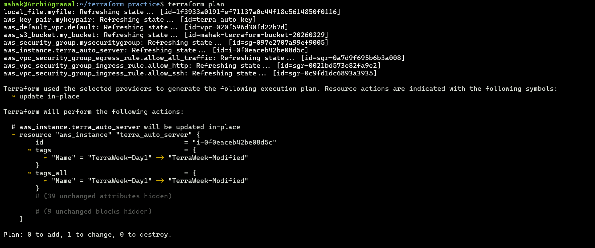
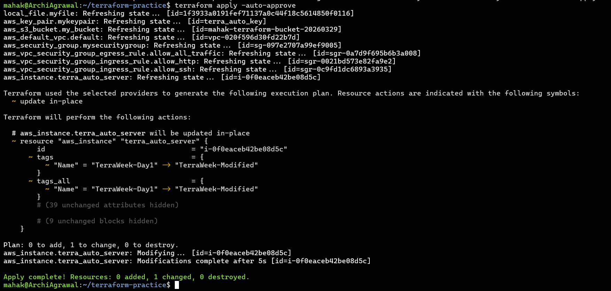
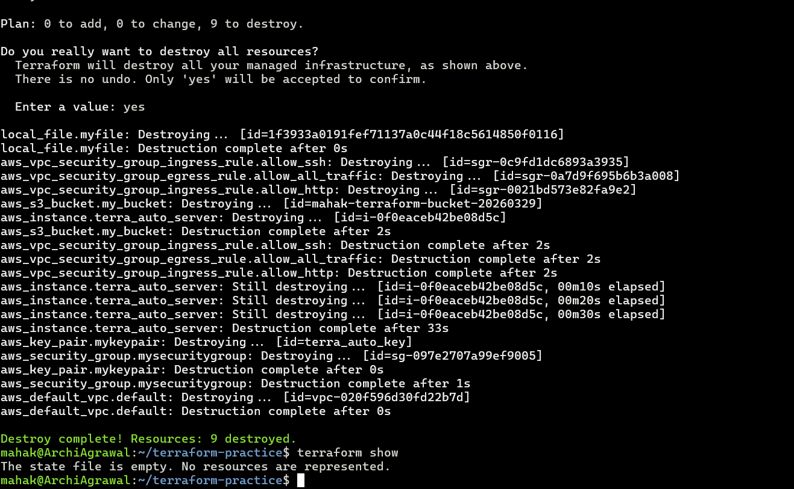

## Challenge Tasks

### Task 1: Understand Infrastructure as Code
Before touching the terminal, research and write short notes on:

1. What is Infrastructure as Code (IaC)? Why does it matter in DevOps?

- `IaC` means managing servers, networks, and cloud resources using code instead of clicking through a console.
- In DevOps, this matters because it makes infrastructure `repeatable`, `version‑controlled`, and `automated`. Teams can spin up identical environments quickly, reduce human error, and treat infrastructure changes like software changes (with reviews, testing, and CI/CD).


2. What problems does IaC solve compared to manually creating resources in the AWS console?

- `Consistency`: Manual clicks often lead to “works on my machine” issues; IaC ensures identical environments.
- `Speed`: IaC can deploy dozens of resources in seconds, while manual setup is slow.
- `Auditability`: Code is tracked in Git, so you know who changed what and when.
- `Rollback`: You can revert to a previous version of infrastructure easily.
- `Scalability`: IaC handles complex, multi‑region deployments that would be impractical manually.


3. How is Terraform different from AWS CloudFormation, Ansible, and Pulumi?

- `Terraform`: Open‑source, declarative, cloud‑agnostic tool. Works across AWS, Azure, GCP, Kubernetes, etc.
- `CloudFormation`: AWS‑native, tightly integrated with AWS services, but limited to AWS only.
- `Ansible`: More of a configuration management tool (installing packages, setting up apps) than infrastructure provisioning. It’s procedural rather than declarative.
- `Pulumi`: Lets you write infrastructure in general‑purpose languages (Python, TypeScript, Go), whereas Terraform uses HCL (HashiCorp Configuration Language). Pulumi appeals to developers who prefer traditional programming constructs.


4. What does it mean that Terraform is "declarative" and "cloud-agnostic"?

- `Declarative`: You describe the desired end state (e.g., “I want an EC2 instance with these specs”), and Terraform figures out the steps to get there. You don’t write the step‑by‑step instructions.
- `Cloud‑agnostic`: Terraform works across multiple cloud providers and platforms. The same tool and workflow can manage AWS, Azure, GCP, on‑prem, or Kubernetes, which avoids vendor lock‑in and gives flexibility


✅ Summary: IaC is about treating infrastructure like software. Terraform stands out because it’s declarative, multi‑cloud, and widely adopted, making it a cornerstone of modern DevOps practices.


---

### Task 2: Install Terraform and Configure AWS
1. Install Terraform:

2. Verify:
```bash
terraform -version
```



3. Install and configure the AWS CLI:

4. Verify AWS access:
```bash
aws sts get-caller-identity
```



You should see your AWS account ID and ARN.

---

### Task 3: Your First Terraform Config -- Create an S3 Bucket
Create a project directory and write your first Terraform config:

Create a file called `main.tf` with:

```
terraform {
  required_providers {
    aws = {
      source  = "hashicorp/aws"
      version = "6.38.0"   # pick a stable version
    }
  }
}

provider "aws" {
  region = "us-west-2"    # replace with your preferred region
}

resource "aws_s3_bucket" "my_bucket" {
  bucket = "mahak-terraform-bucket-20260329"  # must be globally unique
  tags = {
    Name        = "MyFirstBucket"
    Environment = "Dev"
  }
}
```


**Document:** What did `terraform init` download? What does the `.terraform/` directory contain?

✅ Why this matters
- Without terraform init, Terraform doesn’t know how to interact with AWS.
- The .terraform/ folder is essentially Terraform’s “toolbox” — it caches everything needed to run plan and apply reliably.
- This makes your project portable: anyone cloning your repo can run terraform init and get the same setup.


---

### Task 4: Add an EC2 Instance
In the same `main.tf`:

```
# EC2 instance
resource "aws_instance" "my_instance" {

  ami           = "ami-0d76b909de1a0595d"   # make sure this AMI exists in your region
  instance_type = "t2.micro"
  key_name      = aws_key_pair.mykeypair.key_name

  tags = {
    Name = "TerraWeek-Day1"
  }

  # Security group already tied to a VPC
  vpc_security_group_ids = [aws_security_group.mysecuritygroup.id]

  # Root storage (EBS)
  root_block_device {
    volume_size = 10
    volume_type = "gp3"
  }
}
```

Go to the AWS EC2 console and verify your instance is running with the correct name tag.

**Document:** How does Terraform know the S3 bucket already exists and only the EC2 instance needs to be created?

✅ Summary: Terraform knows the S3 bucket already exists because it tracks resources in the state file and compares them against your configuration and AWS. That’s why only the EC2 instance is marked for creation.

---

### Task 5: Understand the State File
Terraform tracks everything it creates in a state file. Time to inspect it.

1. Open `terraform.tfstate` in your editor -- read the JSON structure

```
{
  "version": 4,
  "terraform_version": "1.14.8",
  "serial": 45,
  "lineage": "87f188e9-ce72-ac8b-1ae1-00c53a5ffba5",
  "outputs": {},
  "resources": [],
  "check_results": null
}
```

2. Run these commands and document what each returns:

`terraform show`                          # Human-readable view of current state



`terraform state list`                    # List all resources Terraform manages
`terraform state show aws_s3_bucket.<name>`   # Detailed view of a specific resource




3. Answer these questions in your notes:
   - What information does the state file store about each resource?

`Ans:`
- Resource type and name (e.g., aws_instance.terra_auto_server).
- Unique identifiers (like bucket name, instance ID).
- Configuration attributes (AMI, instance type, tags, security groups).
- Metadata Terraform needs to track drift between your config and the real cloud environment.

   - Why should you never manually edit the state file?

`Ans:`
- It’s Terraform’s source of truth. Manual edits can corrupt it, cause mismatches, or make Terraform lose track of resources.
- Instead, use Terraform commands (terraform state mv, terraform import, etc.) to adjust state safely.


   - Why should the state file not be committed to Git?

`Ans:`
- It often contains sensitive data (like resource ARNs, sometimes secrets).
- It changes frequently, so committing it leads to merge conflicts.
- Best practice: store state remotely (e.g., in an S3 bucket with DynamoDB locking) so teams share a single authoritative state.


---

### Task 6: Modify, Plan, and Destroy
1. Change the EC2 instance tag from `"TerraWeek-Day1"` to `"TerraWeek-Modified"` in your `main.tf`




2. Run `terraform plan` and read the output carefully:
   - What do the `~`, `+`, and `-` symbols mean?

`Ans:`
- `~ (tilde)` → Update in place. Terraform will modify an attribute of an existing resource (like changing a tag) without destroying and recreating it.
- `+ (plus)` → Create. A new resource will be added.
- `- (minus)` → Destroy. An existing resource will be removed.
- `-/+ together` → Replace. Terraform will destroy and recreate the resource (used when an attribute cannot be updated in place, e.g., changing an AMI).


   - Is this an in-place update or a destroy-and-recreate?

`Ans:`
Changing the EC2 tag from "TerraWeek-Day1" to "TerraWeek-Modified" is an in‑place update.
- Tags are metadata attributes. Updating them does not require destroying or recreating the instance.
- When you run terraform plan, Terraform shows the ~ symbol next to the tags block, meaning modify in place.
- No -/+ (destroy and recreate) is shown, so the instance itself remains running; only the tag changes.


3. Apply the change





4. Finally, destroy everything:



---